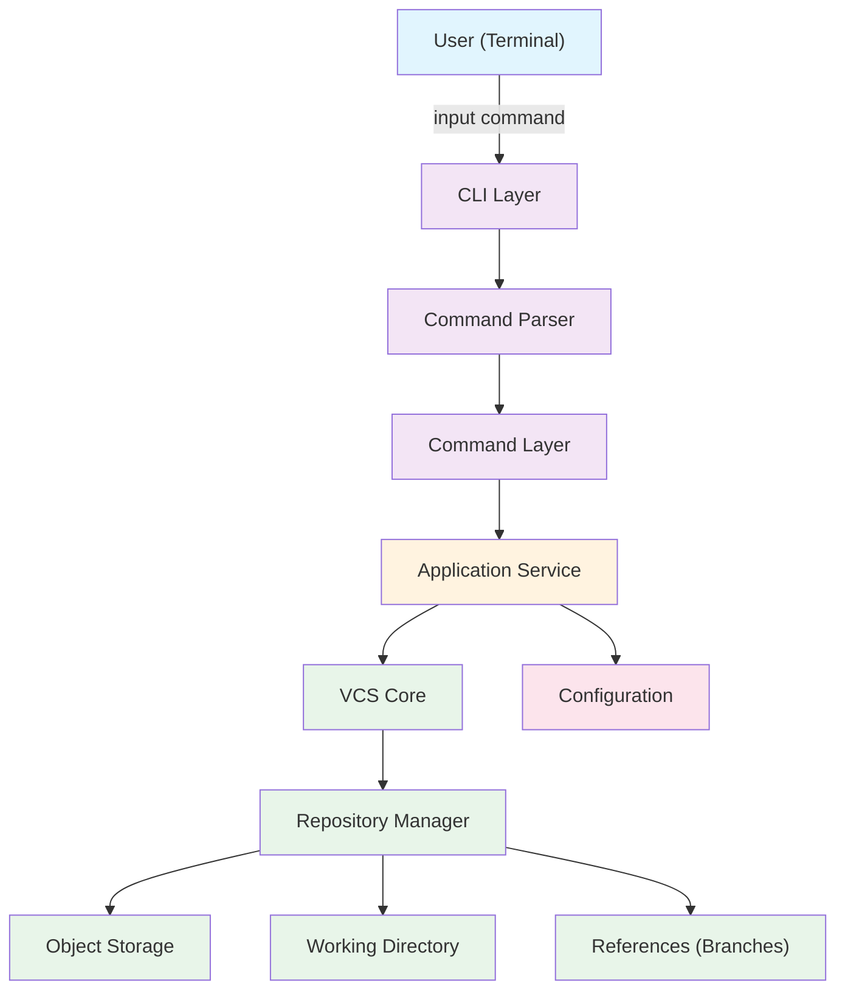
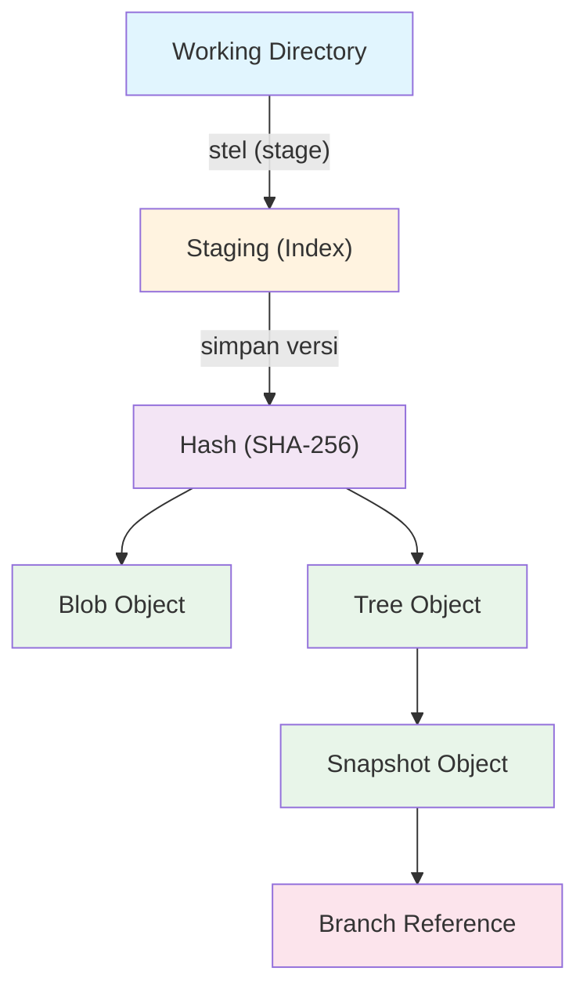
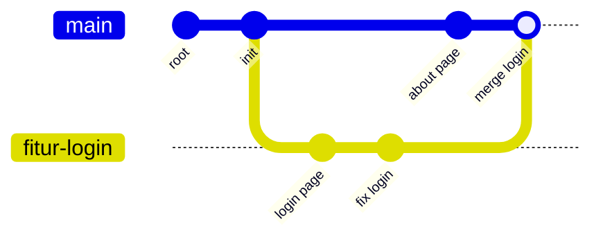
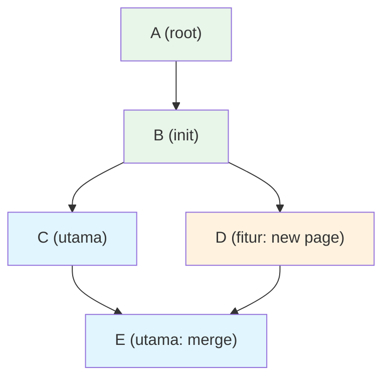
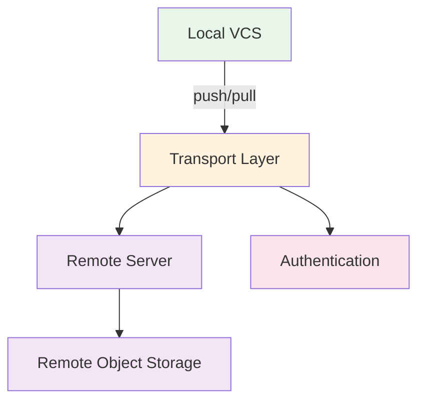

# PRD — <NAMA_PROJECT>

> **Product Requirements Document**
> Versi dokumen: 0.1-draft
> Terakhir diperbarui: 22 Agustus 2026
> Status: **Draft — Menunggu review dan keputusan maintainer**

---

## Table of Contents

1. [Identitas Project](#1-identitas-project)
2. [Executive Summary](#2-executive-summary)
3. [Product Vision](#3-product-vision)
4. [Product Mission](#4-product-mission)
5. [Core Principles](#5-core-principles)
6. [Problem Statement](#6-problem-statement)
7. [Opportunity](#7-opportunity)
8. [Target Users](#8-target-users)
9. [Non-Target Users](#9-non-target-users)
10. [Product Positioning](#10-product-positioning)
11. [Product Scope](#11-product-scope)
12. [Development Philosophy](#12-development-philosophy)
13. [Phase A — Local VCS](#13-phase-a--local-vcs)
14. [Command Language Design](#14-command-language-design)
15. [Command Vocabulary](#15-command-vocabulary)
16. [Command Specification](#16-command-specification)
17. [Command Examples](#17-command-examples)
18. [Terminology System](#18-terminology-system)
19. [Error UX](#19-error-ux)
20. [Educational UX](#20-educational-ux)
21. [CLI UX](#21-cli-ux)
22. [Accessibility](#22-accessibility)
23. [File Support](#23-file-support)
24. [Core Architecture](#24-core-architecture)
25. [Recommended Tech Stack](#25-recommended-tech-stack)
26. [Python vs Go](#26-python-vs-go)
27. [Repository Format](#27-repository-format)
28. [Object Storage](#28-object-storage)
29. [Hashing](#29-hashing)
30. [Snapshot Model](#30-snapshot-model)
31. [Change Detection](#31-change-detection)
32. [Diff Engine](#32-diff-engine)
33. [History](#33-history)
34. [Branch System](#34-branch-system)
35. [Merge Engine](#35-merge-engine)
36. [Restore vs Revert](#36-restore-vs-revert)
37. [Safety Model](#37-safety-model)
38. [Atomicity & Data Integrity](#38-atomicity--data-integrity)
39. [Concurrency](#39-concurrency)
40. [Configuration](#40-configuration)
41. [Ignore System](#41-ignore-system)
42. [Security](#42-security)
43. [Cross-Platform](#43-cross-platform)
44. [Performance](#44-performance)
45. [Large Repository](#45-large-repository)
46. [Testing Strategy](#46-testing-strategy)
47. [Test Matrix](#47-test-matrix)
48. [CLI Acceptance Test](#48-cli-acceptance-test)
49. [UX Acceptance Criteria](#49-ux-acceptance-criteria)
50. [Documentation](#50-documentation)
51. [Project Structure](#51-project-structure)
52. [API Design](#52-api-design)
53. [Exit Codes](#53-exit-codes)
54. [Machine Readable Output](#54-machine-readable-output)
55. [Interactive Mode](#55-interactive-mode)
56. [Alias System](#56-alias-system)
57. [Localization](#57-localization)
58. [Internationalization Strategy](#58-internationalization-strategy)
59. [AI Friendly UX](#59-ai-friendly-ux)
60. [Observability & Debugging](#60-observability--debugging)
61. [Telemetry](#61-telemetry)
62. [Privacy](#62-privacy)
63. [Licensing](#63-licensing)
64. [Roadmap](#64-roadmap)
65. [MVP Feature Priority](#65-mvp-feature-priority)
66. [User Stories](#66-user-stories)
67. [Use Cases](#67-use-cases)
68. [Edge Cases](#68-edge-cases)
69. [Failure Modes](#69-failure-modes)
70. [Threat Model](#70-threat-model)
71. [Quality Requirements](#71-quality-requirements)
72. [Definition of Done](#72-definition-of-done)
73. [Release Strategy](#73-release-strategy)
74. [Versioning](#74-versioning)
75. [Backward Compatibility](#75-backward-compatibility)
76. [CLI Compatibility](#76-cli-compatibility)
77. [Security Update Policy](#77-security-update-policy)
78. [Contribution Model](#78-contribution-model)
79. [RFC System](#79-rfc-system)
80. [Design Decision Record](#80-design-decision-record)
81. [Competitive Differentiation](#81-competitive-differentiation)
82. [Product Metrics](#82-product-metrics)
83. [Usability Testing](#83-usability-testing)
84. [Learning Curve Test](#84-learning-curve-test)
85. [Sample User Journey](#85-sample-user-journey)
86. [Onboarding](#86-onboarding)
87. [Help System](#87-help-system)
88. [Documentation Information Architecture](#88-documentation-information-architecture)
89. [Examples](#89-examples)
90. [Future Phase B](#90-future-phase-b)
91. [Future Phase C](#91-future-phase-c)
92. [Future — Education Mode](#92-future--education-mode)
93. [Future — Visual History](#93-future--visual-history)
94. [Future — GUI](#94-future--gui)
95. [Future — IDE Integration](#95-future--ide-integration)
96. [Future — Remote Protocol](#96-future--remote-protocol)
97. [Non-Functional Requirements](#97-non-functional-requirements)
98. [Technical Risks](#98-technical-risks)
99. [Product Risks](#99-product-risks)
100. [Anti-AI-Slop Requirement](#100-anti-ai-slop-requirement)
101. [Code Quality](#101-code-quality)
102. [Dependency Policy](#102-dependency-policy)
103. [CLI Style Guide](#103-cli-style-guide)
104. [Command Language Style Guide](#104-command-language-style-guide)
105. [Example CLI Session](#105-example-cli-session)
106. [Sample Error Catalog](#106-sample-error-catalog)
107. [Installation Experience](#107-installation-experience)
108. [Packaging](#108-packaging)
109. [CI/CD](#109-cicd)
110. [Release Artifacts](#110-release-artifacts)
111. [Project Governance](#111-project-governance)
112. [Open Source Community](#112-open-source-community)
113. [Future Branding](#113-future-branding)
114. [Product North Star](#114-product-north-star)
115. [MVP Success Criteria](#115-mvp-success-criteria)
116. [MVP Non-Goals](#116-mvp-non-goals)
117. [Final Product Architecture](#117-final-product-architecture)
118. [Final Requirement Matrix](#118-final-requirement-matrix)
119. [Traceability](#119-traceability)
120. [Open Questions](#120-open-questions)
121. [Final Recommendation](#121-final-recommendation)
122. [Implementation Order](#122-implementation-order)
123. [AI Coding Agent Development Rules](#123-ai-coding-agent-development-rules)
124. [Development Rule](#124-development-rule)
125. [PRD Writing Requirements](#125-prd-writing-requirements)
126. [Important Product Philosophy](#126-important-product-philosophy)
127. [Final Output](#127-final-output)

---

## 1. Identitas Project

| Field | Value |
| --- | --- |
| **Nama Project** | `<NAMA_PROJECT>` (belum final) |
| **Codename** | `vesi` (Indonesian: "versi") — tentatif |
| **Kategori** | Developer Tool / Version Control System |
| **Jenis Software** | CLI tool, local-first version control |
| **Status Pengembangan** | Pre-development (PRD phase) |
| **Target Platform** | Linux, macOS, Windows |
| **Lisensi** | TBD — rekomendasi: MIT atau Apache-2.0 (lihat [Licensing](#63-licensing)) |
| **Repository Model** | Open source, GitHub-hosted |
| **Tujuan Utama** | Menjadi VCS paling mudah dipelajari pemula tanpa mengorbankan kemampuan teknis |
| **Tagline** | `Easy to learn, serious to use.` |

**Catatan:** Nama `<NAMA_PROJECT>` bersifat placeholder. Nama final ditentukan melalui proses branding terpisah. Semua referensi dalam dokumen ini menggunakan placeholder sampai nama final ditentukan.

---

## 2. Executive Summary

### Apa project ini?

`<NAMA_PROJECT>` adalah **Version Control System (VCS) baru** yang dirancang dari awal dengan antarmuka command-line berbahasa Indonesia. Project ini bukan "Git yang diterjemahkan ke Bahasa Indonesia" — melainkan sebuah VCS baru dengan UX, command language, error handling, dan educational layer yang didesain khusus untuk kemudahan belajar pemula.

### Masalah apa yang ingin diselesaikan?

Version control adalah keterampilan fundamental dalam software development, namun **learning curve-nya sangat curam** bagi pemula. Git, meskipun powerful, memiliki terminologi teknis yang membingungkan, command yang tidak intuitif, dan error messages yang sering cryptic. Banyak pelajar dan programmer pemula menghabiskan waktu berhari-hari hanya untuk memahami perbedaan antara `git add`, `git commit`, `git push`, dan `git status`.

### Kenapa Git/version control terasa sulit bagi pemula?

1. **Istilah teknis**: staging area, HEAD, detached HEAD, index — istilah ini tidak memiliki padanan alami dalam bahasa sehari-hari.
2. **Command yang tidak natural**: `git checkout` digunakan untuk banyak hal berbeda, `git reset` memiliki tiga mode yang berbeda.
3. **Error messages yang cryptic**: pesan seperti "fatal: bad default revision 'HEAD'" tidak membantu pemula.
4. **Konsep abstrak**: commit graph, branch pointer, reflog — konsep ini perlu model mental yang kuat.
5. **Fear of making mistakes**: pemula takut "merusak" repository karena operasi terasa irreversible.

### Apa yang membedakan project ini?

1. **Bahasa Indonesia natural** — command menggunakan kata-kata yang sudah dikenal pengguna.
2. **Error yang membantu** — setiap error menjelaskan masalah dan memberikan solusi.
3. **Educational by design** — fitur `jelaskan` membantu pengguna memahami konsep.
4. **Professional under the hood** — meskipun command-nya sederhana, engine-nya dirancang serius.
5. **Safe by default** — operasi destruktif selalu meminta konfirmasi.

### Siapa pengguna utamanya?

- Pelajar SMP/SMA yang belajar programming
- Programmer pemula yang baru belajar version control
- Guru dan mentor yang mengajarkan programming
- Pengguna umum yang ingin menyimpan perubahan dokumen
- Developer yang menggunakan AI coding agents

### Nilai utama project

> **Bahasa antarmuka sederhana, teknologi internal serius.**

### Roadmap ringkas

```text
Phase A: Local VCS (MVP)
    ↓
Phase B: Remote VCS (repository sharing)
    ↓
Phase C: Full Ecosystem (web, collaboration, CI/CD)
```

### Kenapa project ini layak dibuat?

- Jutaan pelajar di Indonesia membutuhkan cara yang lebih mudah untuk belajar version control.
- Tidak ada VCS yang dirancang khusus untuk pemula dengan bahasa lokal.
- Open source ecosystem memungkinkan kontribusi dari komunitas.
- AI coding tools semakin populer, dan VCS yang AI-friendly menjadi nilai tambah.

---

## 3. Product Vision

### Visi

> **Menjadi version control system yang paling gampang dipelajari pemula tanpa mengorbankan kemampuan, keamanan, dan profesionalisme.**

### Bagaimana visi ini terwujud

Project ini memposisikan diri sebagai **jembatan**:

```text
Pemula ──────────────────────────────────► Profesional
        │                                    │
        │  mulai proyek                      │  deep merge
        │  simpan versi "awal"               │  branch management
        │  lihat perubahan                   │  repository integrity
        │                                    │
        └── Command sederhana ───────────────┘
              Engine serius di balik layar
```

**Level pengguna:**

| Level | Kebutuhan | Fitur yang relevan |
| --- | --- | --- |
| **Pemula absolut** | Simpan perubahan, lihat riwayat | `mulai proyek`, `simpan versi`, `lihat riwayat` |
| **Pemula lanjut** | Branch, merge, restore | `buat cabang`, `gabungkan`, `pulihkan` |
| **Intermediate** | Workflow yang lebih kompleks | Semua command + konfigurasi |
| **Profesional** | Automasi, script, integrasi | `--json`, exit codes, machine-readable output |
| **AI Agent** | Structured output, predictable behavior | `--json`, `--quiet`, consistent output format |

Visi ini bukan berarti project harus menjadi "Git killer". Visinya adalah **memperluas akses** ke version control kepada jutaan orang yang merasa Git terlalu sulit, sambil tetap menjadi tool yang layak digunakan oleh programmer berpengalaman.

---

## 4. Product Mission

### Mission Statement

> `<NAMA_PROJECT>` hadir untuk menyederhanakan version control tanpa mengorbankan kekuatan teknis. Kami percaya bahwa setiap orang — dari pelajar SMP hingga software engineer berpengalaman — berhak mendapatkan tool version control yang mudah dipahami, aman digunakan, dan serius untuk project nyata.

### Tujuan spesifik

1. **Menyederhanakan version control** — command yang mudah diingat dan konsisten.
2. **Membuat version control ramah pemula** — error yang membantu, bukan menakut-nakuti.
3. **Menggunakan Bahasa Indonesia natural** — command yang terasa seperti bahasa sehari-hari, bukan terminologi teknis.
4. **Mempertahankan kemampuan teknis** — engine serius dengan object storage, hashing, merge algorithm yang proper.
5. **Membantu pelajar memahami konsep** — fitur edukasi terintegrasi, bukan dokumentasi terpisah.
6. **Tool untuk semua orang** — dapat digunakan oleh programmer, non-programmer, dan AI agents.
7. **Fondasi open-source yang sehat** — kontribusi terstruktur, dokumentasi lengkap, governance jelas.

---

## 5. Core Principles

### 1. Beginner First

Semua keputusan UX, command design, dan error handling harus dievaluasi dari perspektif pemula terlebih dahulu. Jika sebuah fitur hanya bisa dipahami oleh programmer berpengalaman, ia harus memiliki cara untuk "growing into" fitur tersebut secara bertahap.

### 2. Natural Language

Command harus terasa seperti instruksi natural dalam Bahasa Indonesia, bukan seperti sintaks pemrograman. Hindari command yang hanya bisa dipahami jika seseorang sudah membaca manual.

### 3. Professional Under the Hood

Di balik command yang sederhana, engine harus menggunakan algoritma dan struktur data yang benar: content-addressed storage, proper hashing, merge algorithm yang benar, data integrity checking. "Simple" di level UX, "serious" di level engine.

### 4. Explicit Over Magical

Lebih baik meminta pengguna memilih secara eksplisit daripada menebak keinginan mereka. Magic yang gagal lebih buruk daripada kejelasan yang sedikit verbose.

### 5. Safe by Default

Operasi yang dapat menyebabkan kehilangan data harus memiliki konfirmasi, dry-run, atau backup. Pengguna harus merasa aman bereksperimen dengan tool ini.

### 6. Human-Friendly Error

Error messages harus menjelaskan masalah, menunjukkan solusi, dan memberikan contoh. Error tidak boleh menyalahkan pengguna.

### 7. Educational by Design

Setiap command dan konsep harus memiliki jalur edukasi. Fitur `jelaskan` terintegrasi dalam tool, bukan hanya di dokumentasi eksternal.

### 8. Cross-Platform

Tool harus berjalan dengan benar dan konsisten di Windows, Linux, dan macOS tanpa perilaku yang berbeda secara signifikan.

### 9. Local-First

Pada Phase A, tidak ada data yang dikirim ke luar. Semua operasi terjadi di filesystem lokal. Pengguna memiliki kontrol penuh atas data mereka.

### 10. Open Source Friendly

Project harus menerima kontribusi dari komunitas. Dokumentasi, contribution guide, dan RFC process harus tersedia sejak awal.

### 11. Stable Core

Perubahan pada format repository dan command language harus dilakukan melalui RFC process dengan backward compatibility sebagai prioritas.

### 12. Backward Compatibility

Update tool tidak boleh merusak repository yang sudah ada. Repository lama harus selalu bisa dibaca oleh versi tool yang lebih baru.

---

## 6. Problem Statement

### Git adalah teknologi hebat

Git adalah salah satu alat software paling sukses dalam sejarah. Diciptakan oleh Linus Torvalds untuk mengelola kernel Linux, Git telah menjadi standar de facto version control di seluruh industri software. Kemampuannya, performanya, dan ekosistemnya (GitHub, GitLab, Bitbucket) tidak perlu diragukan.

### Tapi Git memiliki tantangan UX

| Masalah | Penjelasan |
| --- | --- |
| **Learning curve curam** | Pemula membutuhkan waktu berminggu-minggu untuk memahami workflow dasar |
| **Istilah teknis membingungkan** | Staging area, HEAD, reflog, detached HEAD — istilah ini tidak intuitif |
| **Command tidak konsisten** | `git checkout` untuk switch branch DAN restore file; `git reset` punya 3 mode |
| **Error messages cryptic** | "fatal: bad default revision 'HEAD'" tidak membantu pemula |
| **Konsep abstrak** | Commit graph, branch pointer, index — perlu model mental yang kuat |
| **Takut membuat kesalahan** | Pemula khawatir "merusak" repository |
| **Command berbahasa Inggris teknis** | Barrier bahasa untuk non-native English speakers |

### Pendekatan yang berbeda

`<NAMA_PROJECT>` tidak mencoba menggantikan Git. Project ini mengambil pendekatan UX yang berbeda: **bagaimana jika command language dirancang dari awal untuk manusia, bukan untuk mesin?**

Perbedaan fundamental:

| Aspek | Git | `<NAMA_PROJECT>` |
| --- | --- | --- |
| **Command language** | Inggris teknis | Indonesia natural |
| **Error philosophy** | Technical accuracy | Human helpfulness |
| **Learning approach** | Dokumentasi eksternal | Built-in education |
| **Safety** | Trust the user | Protect by default |
| **Target** | Professional developers | Everyone (growing into proficiency) |

---

## 7. Opportunity

### Pendidikan

Indonesia memiliki jutaan pelajar yang mulai belajar programming. Version control adalah keterampilan fundamental, tetapi jarang diajarkan di sekolah karena tools-nya dianggap terlalu sulit.

### Pelajar & Sekolah

Coding club, ekstrakurikuler programming, dan kelas komputer di sekolah membutuhkan VCS yang dapat diajarkan dalam satu sesi, bukan satu semester.

### Developer Education

Bootcamp, kursus online, dan materi pembelajaran programming membutuhkan tool yang mengurangi friction dalam mengajarkan version control.

### Kreator & Pengguna Umum

Desainer grafis, penulis, content creator — mereka semua perlu menyimpan perubahan file, tetapi tidak memerlukan kompleksitas Git.

### Open Source

Indonesia memiliki komunitas open source yang tumbuh. Tool yang mudah digunakan dapat meningkatkan kontribusi open source dari developer Indonesia.

### AI Coding Agents

AI coding agents membutuhkan structured, predictable output dari tools. `<NAMA_PROJECT>` dapat menjadi VCS yang ramah AI dengan output terstruktur dan command yang konsisten.

---

## 8. Target Users

### Persona 1 — Pelajar SMP

| Field | Detail |
| --- | --- |
| **Profil** | Usia 12-15 tahun, baru mulai belajar programming, menggunakan komputer sekolah atau laptop pribadi |
| **Goal** | Menyimpan perubahan code supaya tidak hilang, memahami apa itu version control |
| **Pain point** | Belum pernah dengar version control; istilah teknis membuat bingung; takut "salah" |
| **Behavior** | Menyalin folder manual ("project_v1", "project_v2_final", "project_v2_final_beneran") |
| **Needs** | Command sederhana yang bisa diingat, output yang bisa dimengerti tanpa dokumentasi |
| **Expected feature** | `mulai proyek`, `simpan versi`, `lihat riwayat` |
| **Success criteria** | Berhasil membuat versi pertama dalam < 2 menit tanpa bantuan |

### Persona 2 — Pelajar SMA/SMK

| Field | Detail |
| --- | --- |
| **Profil** | Usia 15-18 tahun, belajar programming lebih serius, mungkin mengikuti lomba atau project sekolah |
| **Goal** | Mengelola project dengan lebih baik, memahami branch dan merge |
| **Pain point** | Sudah pernah dengar Git tapi bingung cara pakainya; takut merge conflict |
| **Behavior** | Copy-paste Git commands dari Stack Overflow tanpa memahami |
| **Needs** | Penjelasan konsep yang built-in, command yang consistent |
| **Expected feature** | Semua command dasar + `buat cabang`, `gabungkan` |
| **Success criteria** | Dapat menggunakan branch dan merge untuk project sekolah |

### Persona 3 — Programmer Pemula

| Field | Detail |
| --- | --- |
| **Profil** | Usia 18-25 tahun, baru mulai career di software development, belajar Git dari tutorial |
| **Goal** | Menguasai version control untuk pekerjaan |
| **Pain point** | Banyak konsep yang tidak jelas; googling untuk setiap command; perbedaan `add` vs `commit` membingungkan |
| **Behavior** | Mengikuti tutorial langkah demi langkah tanpa memahami "kenapa" |
| **Needs** | Konsep yang dijelaskan secara kontekstual, error yang membantu |
| **Expected feature** | Semua command MVP + `bandingkan`, `pulihkan` |
| **Success criteria** | Memahami workflow lengkap dalam 1 hari |

### Persona 4 — Programmer Berpengalaman

| Field | Detail |
| --- | --- |
| **Profil** | Usia 25+ tahun, sudah menguasai Git, mencari efisiensi atau alternatif untuk use case tertentu |
| **Goal** | Evaluasi apakah tool ini memiliki value untuk use case tertentu (pendidikan, sampingan, scripting) |
| **Pain point** | Skeptis terhadap "Git replacement"; butuh bukti kemampuan teknis |
| **Behavior** | Langsung ke advanced features; tidak butuh tutorial |
| **Needs** | Machine-readable output, scripting capability, technical accuracy |
| **Expected feature** | `--json`, exit codes, semua command MVP |
| **Success criteria** | Mengakui tool ini legitimate, bukan toy project |

### Persona 5 — Pengguna Umum

| Field | Detail |
| --- | --- |
| **Profil** | Tidak programmer; penulis, desainer, mahasiswa non-TI; butuh menyimpan perubahan dokumen |
| **Goal** | Menyimpan perubahan file penting supaya tidak hilang, bisa kembali ke versi sebelumnya |
| **Pain point** | Git terlalu teknis; copy-paste folder manual; tidak tahu ada VCS |
| **Behavior** | Membuat banyak salinan folder dengan nama "final", "final_v2", "fix_terakhir" |
| **Needs** | Command yang sangat sederhana, output yang jelas tanpa istilah teknis |
| **Expected feature** | `mulai proyek`, `simpan versi`, `lihat riwayat`, `pulihkan` |
| **Success criteria** | Dapat menyimpan dan memulihkan versi dalam < 5 menit |

### Persona 6 — Guru/Mentor

| Field | Detail |
| --- | --- |
| **Profil** | Guru TI, dosen, mentor coding bootcamp, atau tutor |
| **Goal** | Mengajarkan version control kepada siswa dengan efektif |
| **Pain point** | Waktu terbatas untuk mengajarkan Git; siswa bingung dengan terminologi |
| **Behavior** | Mencari tool yang mudah didemonstrasikan dan dipahami siswa |
| **Needs** | Fitur edukasi, command sederhana, contoh yang bisa langsung dicoba |
| **Expected feature** | `jelaskan`, command sederhana, help system yang bagus |
| **Success criteria** | Dapat mengajarkan konsep VCS dalam 1 sesi kelas |

### Persona 7 — Open Source Contributor

| Field | Detail |
| --- | --- |
| **Profil** | Developer yang ingin berkontribusi ke project open source |
| **Goal** | Berkontribusi dengan cara yang terstruktur dan bermakna |
| **Pain point** | Tidak ada VCS berbahasa Indonesia yang bisa dikontribusi |
| **Behavior** | Mencari project yang menarik di GitHub, membaca code, membuat PR |
| **Needs** | Codebase yang well-structured, dokumentasi lengkap, contribution guide |
| **Expected feature** | `--json` output, clean architecture, test coverage |
| **Success criteria** | Berhasil membuat kontribusi pertama dalam waktu yang wajar |

---

## 9. Non-Target Users

Project ini **bukan** untuk:

| Kategori | Alasan |
| --- | --- |
| **Enterprise distributed source control** | MVP tidak mendukung remote server, authentication, atau authorization |
| **Massive monorepo** | MVP dioptimasi untuk project berukuran ribuan file, bukan ratusan ribu |
| **High-frequency industrial deployment** | Tidak ada CI/CD integration, webhook, atau automation server |
| **Advanced Git replacement untuk semua use case** | Project ini memiliki scope terbatas. Git tetap menjadi pilihan untuk use case lanjut |
| **Enterprise compliance platform** | Tidak ada audit log, SSO, RBAC, atau compliance features |

**Catatan:** Non-target users ini berlaku untuk **MVP (Phase A)**. Phase B dan Phase C mungkin memperluas scope.

---

## 10. Product Positioning

### Posisi

> **"Version control yang paling gampang dipelajari pemula."**

### Perbandingan Konseptual

| Product | Fokus | Kelebihan | Kekurangan | Posisi `<NAMA_PROJECT>` |
| --- | --- | --- | --- | --- |
| **Git** | Professional VCS | Powerful, industry standard, ecosystem luas | Learning curve curam, UX kompleks | `<NAMA_PROJECT>` lebih mudah dipelajari |
| **GitHub** | Remote hosting + collaboration | Platform kolaborasi, CI/CD, social | Bergantung pada Git, memerlukan internet | `<NAMA_PROJECT>` local-first, bisa tanpa internet |
| **GitLab** | DevOps platform | All-in-one DevOps | Berat, kompleks | `<NAMA_PROJECT>` lightweight, CLI-focused |
| **SVN** | Centralized VCS | Sederhana dari Git | Single point of failure, dated | `<NAMA_PROJECT>` modern, decentralized |
| **Cloud storage** | File storage | Mudah, familiar | Bukan VCS — tidak ada history, diff, branch | `<NAMA_PROJECT>` punya semua kemampuan VCS |
| **File backup** | File backup | Mudah digunakan | Tidak ada diff, merge, branch | `<NAMA_PROJECT>` lebih structured |

### Positioning Statement

Untuk **pelajar, pemula, dan pengguna umum** yang merasa **version control terlalu sulit**, `<NAMA_PROJECT>` adalah **VCS dengan command berbahasa Indonesia** yang membuat version control semudah mengetik instruksi natural. Berbeda dengan Git yang dirancang untuk profesional, `<NAMA_PROJECT>` dirancang untuk manusia — dari pemula hingga expert — dengan engine serius di balik layar.

**Catatan:** Klaim di atas belum diverifikasi melalui user research. Akan diuji setelah prototype tersedia.

---

## 11. Product Scope

### MVP (Minimum Viable Product) — Phase A

| Fitur | Scope |
| --- | --- |
| Inisialisasi repository | `mulai proyek` |
| Deteksi repository | Auto-detect apakah sudah ada repository |
| Track file | File tracking dengan staging |
| Ignore file | `.abaikan` file (mirip `.gitignore`) |
| Deteksi perubahan | New, modified, deleted, renamed |
| Snapshot | Content-addressed snapshot/commit |
| Simpan versi | `simpan versi "pesan"` |
| Riwayat | `lihat riwayat` |
| Diff | `bandingkan` |
| Pulihkan file | `pulihkan [file]` |
| Batalkan perubahan | `batalkan perubahan [file]` |
| Cabang dasar | `buat cabang`, `lihat cabang`, `pindah cabang`, `hapus cabang` |
| Gabungkan | Fast-forward + three-way merge dasar |
| Integrity check | `cek` / `cek proyek` |
| Konfigurasi | `konfigurasi` |
| Bantuan | `bantuan [command]` |
| Versi tool | `--version` |
| Diagnostik | Debug info, verbose mode |

### V1 (Setelah MVP stabil)

| Fitur | Scope |
| --- | --- |
| Remote repository | `bagikan`, `ambil`, `unduh` |
| Tag system | `beri tag` |
| Advanced merge | Conflict resolution yang lebih baik |
| Interactive rebase (sederhana) | TBD |
| Plugin system | FUTURE |
| JSON output | `--json` untuk semua command |
| Interactive mode | Shell interaktif |

### V2 (Ecosystem)

| Fitur | Scope |
| --- | --- |
| Web repository hosting | GitHub-like untuk `<NAMA_PROJECT>` |
| Collaboration features | Code review, PR system |
| CI/CD integration | Webhook, pipeline |
| Package registry | Untuk project Python, dll. |
| Educational platform | `mode belajar` |
| IDE integration | VS Code extension |

### Future (Beyond V2)

| Fitur | Scope |
| --- | --- |
| GUI client | Desktop app |
| Mobile viewer | Lihat riwayat di mobile |
| Enterprise features | SSO, audit log, RBAC |
| AI integration | AI-powered conflict resolution, code review |

### Out of Scope (untuk semua phase saat ini)

- Cryptocurrency / blockchain
- Game engine integration
- Real-time collaboration editing (Google Docs-style)
- Social network features

---

## 12. Development Philosophy

### Pendekatan bertahap

Project ini dikembangkan secara incremental. Setiap phase menghasilkan software yang **dapat dijalankan dan berguna**, meskipun belum lengkap.

```text
Phase A: Local VCS (MVP)
├── Bisa digunakan untuk project nyata
├── Semua operasi lokal
├── Tidak memerlukan internet
└── Foundation untuk phase selanjutnya

Phase B: Remote VCS
├── Repository sharing
├── Push / Pull
├── Authentication
└── Collaboration basics

Phase C: Full Ecosystem
├── Web platform
├── CI/CD
├── Package registry
├── IDE integration
└── Educational features
```

### Kenapa Phase A harus diselesaikan terlebih dahulu?

1. **Tanpa local engine yang benar, remote tidak ada artinya.** Remote VCS pada dasarnya adalah sync layer di atas local VCS.
2. **User bisa langsung menggunakannya.** Phase A sudah memberikan value — user bisa mengelola versi project lokal.
3. **Foundation testing.** Semua core algorithms (hashing, merge, diff) harus benar dan teruji sebelum ditambah complexity remote.
4. **Mengurangi risiko.** Setiap phase yang selesai adalah milestone yang bisa di-stabilkan sebelum lanjut.
5. **Community building.** Open source project perlu MVP yang bisa dicoba orang untuk menarik contributor.

---

## 13. Phase A — Local VCS

### Feature Breakdown

#### 13.1 Inisialisasi Repository

| Field | Detail |
| --- | --- |
| **Command** | `mulai proyek` |
| **Tujuan** | Membuat repository baru di direktori saat ini |
| **Input** | `mulai proyek` atau `mulai proyek <nama>` |
| **Output** | Struktur repository dibuat, file awal dibuat |
| **Edge cases** | Sudah ada repository → warning; Folder kosong → tetap boleh; Folder read-only → error |
| **Error handling** | Permission denied → saran check permissions; Path tidak valid → saran path |
| **Acceptance criteria** | Struktur `<NAMA_PROJECT>` dibuat; file `.abaikan` default dibuat; status awal dapat dilihat; file yang sudah ada tidak dimodifikasi |

#### 13.2 Deteksi Repository

| Field | Detail |
| --- | --- |
| **Command** | Auto-detect setiap command |
| **Tujuan** | Secara otomatis mendeteksi apakah direktori saat ini berada dalam repository |
| **Behavior** | Cari direktori `.<NAMA_PROJECT>` di direktori saat ini dan parent directories |
| **Edge cases** | Tidak ada repository → pesan yang jelas; Repository di parent → gunakan parent |
| **Acceptance criteria** | Deteksi berfungsi di semua OS; tidak error jika tidak ada repository |

#### 13.3 Track File

| Field | Detail |
| --- | --- |
| **Command** | `lihat perubahan` (untuk melihat status tracking) |
| **Tujuan** | Mendeteksi file baru, yang diubah, yang dihapus, yang di-rename |
| **Input** | Working directory scan |
| **Output** | Daftar file dengan status: baru (`?`), diubah (`M`), dihapus (`D`), siap (`.`) |
| **Edge cases** | File binary, symlink, file sangat besar, file dengan encoding aneh |
| **Acceptance criteria** | Semua jenis perubahan terdeteksi dengan benar; binary file tidak crash tool |

#### 13.4 Ignore File

| Field | Detail |
| --- | --- |
| **File** | `.abaikan` (di root repository) |
| **Tujuan** | Menentukan file/direktori yang tidak perlu dilacak |
| **Syntax** | Mirip `.gitignore`: wildcard, direktori, negasi |
| **Default** | `__pycache__/`, `*.pyc`, `.env`, `node_modules/`, `.DS_Store`, `Thumbs.db` |
| **Edge cases** | File yang sudah dilacak lalu di-ignore; syntax invalid; precedence antar file |
| **Acceptance criteria** | Pattern bekerja dengan benar; negasi bekerja; direktori di-ignore dengan benar |

#### 13.5 Deteksi Perubahan

| Field | Detail |
| --- | --- |
| **Tujuan** | Mendeteksi apakah file berubah sejak snapshot terakhir |
| **Metode** | Kombinasi: file size → hash (SHA-256) untuk yang berubah size; mtime sebagai pre-filter |
| **Edge cases** | File di-modify lalu di-rename ke name yang sama; content tidak berubah tapi mtime berubah |
| **Acceptance criteria** | Tidak ada false positive; tidak ada false negative; efisien untuk ribuan file |

#### 13.6 Snapshot

| Field | Detail |
| --- | --- |
| **Tujuan** | Menyimpan keadaan lengkap project pada waktu tertentu |
| **Input** | Staged files (atau semua file yang dilacak) |
| **Output** | Snapshot object dengan: parent, tree, metadata, message |
| **Acceptance criteria** | Snapshot dapat direkonstruksi; integrity terjaga; parent chain benar |

#### 13.7 Simpan Versi

| Field | Detail |
| --- | --- |
| **Command** | `simpan versi "pesan"` |
| **Alias** | `simpan "pesan"` |
| **Tujuan** | Membuat snapshot + menyimpannya ke riwayat |
| **Input** | Pesan versi (wajib), file yang di-stage |
| **Output** | Konfirmasi dengan ID singkat dan pesan |
| **Edge cases** | Tidak ada perubahan → pesan informatif; Pesan kosong → saran; Working directory clean → pesan |
| **Acceptance criteria** | Snapshot tersimpan; riwayat ter-update; file tetap utuh di working directory |

#### 13.8 Riwayat

| Field | Detail |
| --- | --- |
| **Command** | `lihat riwayat` |
| **Alias** | `riwayat` |
| **Tujuan** | Menampilkan daftar versi yang sudah disimpan |
| **Output** | Daftar versi dengan: ID, pesan, timestamp, jumlah file berubah |
| **Edge cases** | Repository kosong; Riwayat sangat panjang (pagination) |
| **Acceptance criteria** | Riwayat ditampilkan dalam format yang mudah dibaca; ID pendek unik |

#### 13.9 Diff

| Field | Detail |
| --- | --- |
| **Command** | `bandingkan` |
| **Tujuan** | Membandingkan perubahan antara versi atau working directory |
| **Variasi** | `bandingkan` (working directory), `bandingkan <versi1> <versi2>` (antara versi) |
| **Output** | Line-based diff untuk text file; "file binary berubah" untuk binary |
| **Edge cases** | File binary; file sangat besar; file dihapus; file baru; encoding berbeda |
| **Acceptance criteria** | Diff text akurat; binary dideteksi; large file tidak crash |

#### 13.10 Pulihkan

| Field | Detail |
| --- | --- |
| **Command** | `pulihkan <file>` |
| **Tujuan** | Mengembalikan file tertentu ke keadaan terakhir yang tersimpan |
| **Output** | Konfirmasi pemulihan |
| **Edge cases** | File baru (belum pernah disimpan); file tidak ditemukan; file sudah sesuai |
| **Safety** | Konfirmasi sebelum overwrite; backup file saat ini sebelum pulihkan |
| **Acceptance criteria** | File dikembalikan dengan benar; backup tersedia; integrity terjaga |

#### 13.11 Batalkan Perubahan

| Field | Detail |
| --- | --- |
| **Command** | `batalkan perubahan <file>` |
| **Alias** | `batalkan <file>` |
| **Tujuan** | Menghapus perubahan yang belum disimpan pada file tertentu |
| **Safety** | Konfirmasi wajib karena operasi destructive |
| **Edge cases** | File baru (untracked); tidak ada perubahan; file sudah di-stage |
| **Acceptance criteria** | Perubahan dibatalkan; file kembali ke keadaan snapshot terakhir |

#### 13.12 Cabang Dasar

| Field | Detail |
| --- | --- |
| **Commands** | `buat cabang <nama>`, `lihat cabang`, `pindah cabang <nama>`, `hapus cabang <nama>` |
| **Tujuan** | Branching untuk parallel development |
| **Output** | Konfirmasi + daftar cabang |
| **Edge cases** | Cabang sudah ada; cabang aktif tidak bisa dihapus; nama duplikat; switch ke cabang yang punya perubahan |
| **Acceptance criteria** | Branch point benar; switch branch benar; delete aman |

#### 13.13 Gabungkan

| Field | Detail |
| --- | --- |
| **Command** | `gabungkan <cabang>` |
| **Tujuan** | Merge branch ke branch aktif |
| **Algorithm** | Fast-forward jika linear; three-way merge jika divergen |
| **Output** | Hasil merge: sukses / conflict |
| **Conflict handling** | Tampilkan file yang conflict; instruksi untuk resolve; `lanjutkan gabungan` setelah resolve; `batalkan gabungan` untuk abort |
| **Acceptance criteria** | Fast-forward benar; three-way merge benar; conflict ditangani dengan jelas |

#### 13.14 Repository Integrity

| Field | Detail |
| --- | --- |
| **Command** | `cek` / `cek proyek` |
| **Tujuan** | Memverifikasi integritas repository |
| **Output** | Daftar check: struktur, objects, references, corruption |
| **Acceptance criteria** | Deteksi corruption; tidak ada false positive |

#### 13.15 Konfigurasi

| Field | Detail |
| --- | --- |
| **Command** | `konfigurasi <key> <value>`, `konfigurasi <key>` |
| **Tujuan** | Mengelola pengaturan repository dan global |
| **Config keys** | `user.name`, `user.email` (untuk metadata versi), `core.editor`, `core.language` |
| **Acceptance criteria** | Config tersimpan; config bisa dibaca; config bisa diubah |

#### 13.16 Bantuan

| Field | Detail |
| --- | --- |
| **Command** | `bantuan`, `bantuan <command>` |
| **Tujuan** | Menampilkan panduan penggunaan |
| **Output** | Daftar command (tanpa argumen) atau detail command (dengan argumen) |
| **Acceptance criteria** | Help akurat; contoh command tersedia; konsisten |

#### 13.17 Versi Tool

| Field | Detail |
| --- | --- |
| **Command** | `--version` |
| **Output** | Nama tool, versi, build info |
| **Acceptance criteria** | Output konsisten; format machine-readable |

#### 13.18 Diagnostik

| Field | Detail |
| --- | --- |
| **Command** | `cek` atau `--verbose` pada command lain |
| **Output** | Debug info: versi Python, OS, path repository, jumlah objects, ukuran |
| **Acceptance criteria** | Info lengkap untuk debugging; tidak menampilkan data sensitif |

---

## 14. Command Language Design

### Filosofi

Command language `<NAMA_PROJECT>` dirancang berdasarkan prinsip:

> **Ketik seperti instruksi natural, dapat diproses parser.**

### Aturan Desain

1. **Bahasa Indonesia natural** — command harus terasa seperti kalimat instruksi dalam Bahasa Indonesia.
2. **Konsisten** — pattern yang sama untuk command yang mirip (lihat, simpan, buat, hapus).
3. **Predictable** — jika user tahu satu command, mereka bisa menebak command lainnya.
4. **Readable** — command mudah dibaca dan dipahami, bahkan di output log.
5. **Scriptable** — command dapat digabungkan dalam script/shell.
6. **Extensible** — subcommand dapat ditambahkan tanpa breaking existing commands.
7. **Tidak ambigu** — setiap command memiliki satu arti yang jelas.
8. **Parser-friendly** — struktur command jelas: `verb [subcommand] [arguments] [options]`.

### Struktur Grammar

```text
<command> [subcommand] [arguments...] [--options...]
```

Contoh:

```text
simpan versi "login page selesai"
├── verb: simpan
├── subcommand: versi
├── argument: "login page selesai" (pesan)
└── options: (none)
```

### Konsistensi Pattern

| Pattern | Contoh | Arti |
| --- | --- | --- |
| `lihat <apa>` | `lihat riwayat`, `lihat perubahan`, `lihat cabang` | Menampilkan informasi |
| `simpan <apa>` | `simpan versi "pesan"` | Menyimpan sesuatu |
| `buat <apa>` | `buat cabang <nama>` | Membuat baru |
| `hapus <apa>` | `hapus cabang <nama>` | Menghapus |
| `pulihkan <apa>` | `pulihkan <file>` | Mengembalikan ke keadaan sebelumnya |

---

## 15. Command Vocabulary

### Vocabulary Resmi — Phase A

| Canonical Command | Alias | Fungsi | Terjemahan Teknis |
| --- | --- | --- | --- |
| `mulai proyek` | — | Inisialisasi repository | `init` |
| `lihat perubahan` | — | Status working directory | `status` |
| `simpan versi "pesan"` | `simpan "pesan"` | Buat snapshot + commit | `commit` |
| `lihat riwayat` | `riwayat` | Tampilkan commit history | `log` |
| `bandingkan` | — | Tampilkan diff | `diff` |
| `pulihkan <file>` | — | Restore file dari snapshot | `restore` |
| `batalkan perubahan <file>` | `batalkan <file>` | Discard working changes | `checkout -- <file>` |
| `buat cabang <nama>` | — | Buat branch baru | `branch <name>` |
| `lihat cabang` | `cabang` | List branches | `branch` |
| `pindah cabang <nama>` | — | Switch branch | `checkout <branch>` |
| `hapus cabang <nama>` | — | Delete branch | `branch -d <name>` |
| `gabungkan <cabang>` | — | Merge branch | `merge <branch>` |
| `cek` | `cek proyek` | Integrity check | `fsck` |
| `konfigurasi` | — | Manage config | `config` |
| `bantuan` | `bantuan <cmd>` | Show help | `help` |
| `lanjutkan gabungan` | — | Continue merge after resolve | `merge --continue` |
| `batalkan gabungan` | — | Abort merge | `merge --abort` |
| `jelaskan <konsep>` | — | Education: explain concept | *(tidak ada padanan)* |
| `steling` | `stel` | Stage file ke index | `add` |

### Evaluasi Vocabulary

**Yang dipertahankan:**
- `mulai proyek` — natural, jelas, mudah diingat.
- `simpan versi` — lebih baik dari `commit` untuk pemula. Kata "versi" lebih intuitif.
- `lihat riwayat` — natural, konsisten dengan pattern `lihat <apa>`.
- `cabang` — satu kata, langsung jelas.
- `gabungkan` — natural untuk konsep merge.
- `jelaskan` — fitur unik, edukatif.

**Yang dievaluasi ulang:**
- `steling` → diganti `stel` sebagai alias, atau `kunci` (karena staging = "mengunci" perubahan). **DECISION NEEDED**

**Yang dihindari:**
- Slang/Gen Z berlebihan (`gas`, `gaskeun`, `wkwk`) — cepat usang, merusak profesionalisme.
- Istilah ambigu (`proses`, `jalankan`) — terlalu umum.

---

## 16. Command Specification

### 16.1 `mulai proyek`

```text
NAMA: mulai proyek
TUJUAN: Membuat repository baru di direktori saat ini
SYNTAX: mulai proyek [nama]
ARGUMENT:
  [nama]    — Nama repository (opsional, default: nama direktori)
OPTION: (none untuk MVP)
ALIAS: (none)
CONTOH:
  mulai proyek
  mulai proyek "tugas-sekolah"
OUTPUT:
  ✓ Repository berhasil dibuat!
    Lokasi: ./tugas-sekolah
    Struktur: .<NAMA_PROJECT>/
    File awal: .abaikan
ERROR:
  Jika sudah ada repository:
    "Sudah ada repository di sini. Tidak perlu dibuat lagi."
  Jika permission denied:
    "Tidak bisa membuat folder di lokasi ini. Coba jalankan dengan permissions yang benar."
EXIT CODE:
  0 = sukses
  1 = error (permission, path invalid, dll)
SAFETY: Tidak ada operasi destruktif. File yang sudah ada tidak dimodifikasi.
```

### 16.2 `lihat perubahan`

```text
NAMA: lihat perubahan
TUJUAN: Menampilkan status file di working directory
SYNTAX: lihat perubahan
ARGUMENT: (none)
OPTION: (none untuk MVP)
CONTOH:
  lihat perubahan
OUTPUT:
  Perubahan di direktori saat ini:

  File baru (belum dilacak):
    ? src/utils.py
    ? README.md

  File yang diubah:
    M main.py

  File yang dihapus:
    D old_file.py

  File siap (tidak berubah):
    . main.py

ERROR:
  Tidak ada repository:
    "Belum ada repository di sini. Mulai dengan: mulai proyek"
EXIT CODE:
  0 = sukses
  1 = repository tidak ditemukan
```

### 16.3 `simpan versi`

```text
NAMA: simpan versi
TUJUAN: Menyimpan snapshot dari file yang di-stage
SYNTAX: simpan versi "pesan"
ARGUMENT:
  "pesan"   — Pesan deskriptif (wajib)
ALIAS: simpan "pesan"
CONTOH:
  simpan versi "halaman login selesai"
OUTPUT:
  ✓ Versi tersimpan!
    ID: a1b2c3d
    Pesan: halaman login selesai
    File: 3 file disimpan
    Ukuran: 12.5 KB

ERROR:
  Tidak ada perubahan:
    "Tidak ada perubahan yang perlu disimpan. File sudah dalam keadaan terakhir."
  Pesan kosong:
    "Tulis pesan untuk versi ini. Contoh: simpan versi \"deskripsi perubahan\""
  Tidak ada file yang di-stage:
    "Belum ada file yang disiapkan. Stel file terlebih dahulu: stel <file>"
EXIT CODE:
  0 = sukses
  1 = error
  2 = tidak ada perubahan
SAFETY: Snapshot disimpan tanpa mengubah working directory.
```

### 16.4 `lihat riwayat`

```text
NAMA: lihat riwayat
TUJUAN: Menampilkan daftar versi yang sudah disimpan
SYNTAX: lihat riwayat [ jumlah ]
ARGUMENT:
  [jumlah]  — Jumlah versi yang ditampilkan (opsional, default: 10)
ALIAS: riwayat
CONTOH:
  lihat riwayat
  lihat riwayat 20
OUTPUT:
  Riwayat versi (3 terakhir):

  a1b2c3d  halaman login selesai
           2026-08-22 14:30  (3 file, 12.5 KB)

  f4e5d6a  inisialisasi project
           2026-08-22 14:00  (5 file, 8.2 KB)

  (root)   awal project
           2026-08-22 13:55  (1 file, 0.5 KB)

ERROR:
  Repository kosong:
    "Belum ada versi yang disimpan. Mulai dengan: mulai proyek"
EXIT CODE:
  0 = sukses
```

### 16.5 `bandingkan`

```text
NAMA: bandingkan
TUJUAN: Menampilkan perbedaan antara versi atau working directory
SYNTAX: bandingkan [versi1] [versi2]
ARGUMENT:
  [versi1]  — ID versi pertama (opsional: default = working directory vs snapshot terakhir)
  [versi2]  — ID versi kedua (opsional: default = versi1 vs snapshot terakhir)
CONTOH:
  bandingkan
  bandingkan a1b2c3d f4e5d6a
OUTPUT:
  Perbandingan: working directory vs a1b2c3d

  main.py
  ───────
  @@ -10,6 +10,8 @@
   def login():
  -    return None
  +    return authenticate()
  +    return check_session()

  src/utils.py [file baru]
  +import os
  +import sys

ERROR:
  Versi tidak ditemukan:
    "Versi 'xyz' tidak ditemukan. Gunakan 'lihat riwayat' untuk melihat versi yang ada."
EXIT CODE:
  0 = sukses
  2 = versi tidak ditemukan
```

### 16.6 `pulihkan`

```text
NAMA: pulihkan
TUJUAN: Mengembalikan file ke keadaan dari versi tertentu
SYNTAX: pulihkan <file> [dari <versi>]
ARGUMENT:
  <file>    — Nama file yang akan dipulihkan (wajib)
  <versi>   — ID versi sumber (opsional: default = versi terakhir)
CONTOH:
  pulihkan main.py
  pulihkan main.py dari a1b2c3d
OUTPUT:
  ✓ File 'main.py' dipulihkan dari versi a1b2c3d.
    Backup file saat ini: .<NAMA_PROJECT>/backups/main.py.bak

SAFETY: Backup file saat ini dibuat sebelum overwrite. Konfirmasi diminta jika file belum diubah.
ERROR:
  File tidak ditemukan di versi:
    "File 'main.py' tidak ada di versi a1b2c3d."
  File tidak dilacak:
    "File 'main.py' belum dilacak oleh repository."
EXIT CODE:
  0 = sukses
  1 = error
  2 = file tidak ditemukan
```

### 16.7 `batalkan perubahan`

```text
NAMA: batalkan perubahan
TUJUAN: Menghapus perubahan yang belum disimpan
SYNTAX: batalkan perubahan <file>
ARGUMENT:
  <file>    — File yang perubahannya akan dibatalkan (wajib)
ALIAS: batalkan <file>
CONTOH:
  batalkan perubahan main.py
OUTPUT:
  ⚠ Perubahan pada 'main.py' akan dibatalkan.
    Perubahan yang akan hilang:
    - Baris 10: return None → return authenticate()

    Lanjutkan? [y/N]
  y
  ✓ Perubahan pada 'main.py' dibatalkan.

SAFETY: Selalu konfirmasi. Backup dibuat sebelum pembatalan.
ERROR:
  File baru (untracked):
    "File 'new.py' belum pernah disimpan. Tidak ada yang bisa dibatalkan."
  Tidak ada perubahan:
    "File 'main.py' tidak memiliki perubahan."
EXIT CODE:
  0 = sukses
  2 = tidak ada perubahan
```

### 16.8 `stel`

```text
NAMA: stel
TUJUAN: Menyiapkan file untuk disimpan dalam versi berikutnya
SYNTAX: stel <file> atau stel .
ARGUMENT:
  <file>    — File atau direktori yang akan disiapkan
  .         — Semua file yang berubah
CONTOH:
  stel main.py
  stel src/
  stel .
OUTPUT:
  ✓ 'main.py' disiapkan untuk disimpan.

ERROR:
  File tidak ditemukan:
    "File 'main.py' tidak ditemukan."
EXIT CODE:
  0 = sukses
  1 = file tidak ditemukan
```

### 16.9 Branch Commands

```text
NAMA: buat cabang
SYNTAX: buat cabang <nama>
CONTOH: buat cabang fitur-login
OUTPUT: ✓ Cabang 'fitur-login' dibuat dari versi a1b2c3d

NAMA: lihat cabang
SYNTAX: lihat cabang
ALIAS: cabang
OUTPUT:
  Cabang:
  * utama (aktif)
    fitur-login
    percobaan

NAMA: pindah cabang
SYNTAX: pindah cabang <nama>
CONTOH: pindah cabang fitur-login
OUTPUT: ✓ Berpindah ke cabang 'fitur-login'
ERROR: Ada perubahan belum disimpan → saran stel/batalkan dulu

NAMA: hapus cabang
SYNTAX: hapus cabang <nama>
CONTOH: hapus cabang percobaan
SAFETY: Konfirmasi jika cabang belum digabungkan
OUTPUT: ✓ Cabang 'percobaan' dihapus.
```

### 16.10 `gabungkan`

```text
NAMA: gabungkan
TUJUAN: Menggabungkan branch ke branch aktif
SYNTAX: gabungkan <cabang>
CONTOH:
  gabungkan fitur-login
OUTPUT (sukses):
  ✓ Cabang 'fitur-login' berhasil digabungkan ke 'utama'.
    Gabungan: fast-forward

OUTPUT (conflict):
  ⚠ Ada konflik di:
    src/login.py
    src/utils.py

  Perbaiki file tersebut, lalu jalankan:
    lanjutkan gabungan

  Atau batalkan:
    batalkan gabungan

EXIT CODE:
  0 = sukses
  4 = conflict
```

---

## 17. Command Examples

### Workflow Pemula

```text
$ mulai proyek tugas-math
✓ Repository dibuat di ./tugas-math

$ stel .
✓ 3 file disiapkan untuk disimpan.

$ simpan versi "tugas matematika awal"
✓ Versi tersimpan! ID: a1b2c3d

$ lihat perubahan
  File siap (tidak berubah):
    . tugas1.py
    . tugas2.py
    . README.md

[... edit tugas1.py ...]

$ lihat perubahan
  File yang diubah:
    M tugas1.py

$ stel tugas1.py
✓ 'tugas1.py' disiapkan untuk disimpan.

$ simpan versi "tugas 1 selesai"
✓ Versi tersimpan! ID: b2c3d4e

$ lihat riwayat
  b2c3d4e  tugas 1 selesai
  a1b2c3d  tugas matematika awal
  (root)   awal project
```

### Workflow Programmer

```text
$ mulai proyek website-portfolio
✓ Repository dibuat.

$ buat cabang fitur-portfolio
✓ Cabang 'fitur-portfolio' dibuat.

$ pindah cabang fitur-portfolio
✓ Berpindah ke cabang 'fitur-portfolio'.

[... code portfolio page ...]

$ stel .
$ simpan versi "halaman portfolio selesai"
✓ Versi tersimpan! ID: c3d4e5f

$ pindah cabang utama
✓ Berpindah ke cabang 'utama'.

$ gabungkan fitur-portfolio
✓ Cabang 'fitur-portfolio' berhasil digabungkan.

$ hapus cabang fitur-portfolio
✓ Cabang 'fitur-portfolio' dihapus.
```

### Workflow Recovery

```text
$ lihat riwayat
  a1b2c3d  perubahan terakhir (yang ini salah)
  f4e5d6a  sebelum perubahan salah
  ...

$ bandingkan f4e5d6a a1b2c3d
  [tampilan diff antara kedua versi]

$ pulihkan src/main.py dari f4e5d6a
✓ File 'main.py' dipulihkan dari versi f4e5d6a.

$ simpan versi "membetulkan kesalahan"
✓ Versi tersimpan!
```

---

## 18. Terminology System

### Glossary

| Konsep Teknis | Istilah User (Indonesia) | Istilah Internal | Penjelasan |
| --- | --- | --- | --- |
| Repository | Proyek | Repository | Folder yang dikelola oleh VCS |
| Commit | Versi | Commit / Snapshot | Catatan keadaan proyek pada waktu tertentu |
| Branch | Cabang | Branch | Garis pengembangan paralel |
| Diff | Perbandingan | Diff | Perbedaan antara dua versi |
| History | Riwayat | Log | Daftar semua versi yang pernah disimpan |
| Restore | Pulihkan | Restore | Mengembalikan file ke keadaan sebelumnya |
| Staging | Steling / Stel | Staging Index | Persiapan file sebelum disimpan |
| HEAD | Versi saat ini | HEAD | Referensi ke versi terakhir di branch aktif |
| Working Directory | Direktori kerja | Working Tree | Folder yang sedang dikerjakan |
| Ignore | Abaikan | Ignore Pattern | File yang tidak dilacak oleh VCS |
| Merge | Gabungkan | Merge | Menggabungkan dua branch |
| Conflict | Konflik | Merge Conflict | Perubahan yang tidak bisa digabungkan otomatis |
| Object | Objek | Object | Unit penyimpanan (blob, tree, snapshot) |
| Hash | Hash | Object ID / SHA | Identifier unik berbasis isi file |
| Tag | Label | Tag | Penanda versi tertentu (Phase B) |
| Clone | — | Clone | Salin repository dari remote (Phase B) |
| Push | — | Push | Kirim versi ke remote (Phase B) |
| Pull | — | Pull | Ambil versi dari remote (Phase B) |

### Prinsip Terminology

1. **UI menggunakan istilah user** — output CLI menggunakan "versi", "cabang", "riwayat".
2. **Internal menggunakan istilah engineering** — code, object, commit, branch.
3. **Educational bridge** — command `jelaskan` menjembatani keduanya.
4. **Dokumentasi menyebut keduanya** — documentation selalu mencantumkan istilah teknis yang sesuai.

---

## 19. Error UX

### Prinsip Error

1. **Jangan menyalahkan pengguna** — gunakan "Kayaknya..." atau "Sepertinya...", bukan "Anda salah".
2. **Jelaskan masalah** — apa yang terjadi, kenapa terjadi.
3. **Berikan solusi** — apa yang harus dilakukan pengguna.
4. **Tunjukkan contoh** — command yang benar.
5. **Detail teknis tersedia** — di verbose/debug mode.

### Level Verbosity

| Level | Flag | Kapan Digunakan |
| --- | --- | --- |
| **Normal** | (default) | Pesan yang cukup untuk pemula |
| **Verbose** | `--verbose` | Detail tambahan untuk debugging ringan |
| **Debug** | `--debug` | Full stack trace, internal state |

### Contoh Error

**Command tidak dikenal:**
```text
Kayaknya command-nya belum tepat.

Mungkin yang kamu maksud:
    simpan versi "deskripsi"

Gunakan bantuan untuk melihat semua command:
    bantuan
```

**Repository tidak ditemukan:**
```text
Belum ada repository di direktori ini.

Mulai repository baru:
    mulai proyek

Atau cek apakah kamu berada di folder yang benar.
```

**Tidak ada perubahan:**
```text
Tidak ada perubahan yang perlu disimpan.

Semua file sudah dalam keadaan terakhir yang tersimpan.
```

---

## 20. Educational UX

### Command `jelaskan`

Fitur unik `<NAMA_PROJECT>` — command built-in untuk memahami konsep VCS.

**Syntax:**

```text
jelaskan <konsep>
```

**Contoh:**

```text
$ jelaskan versi

  Apa itu "versi"?
  ────────────────
  Versi adalah catatan keadaan proyek pada suatu waktu.

  Sederhananya:
  kamu menyimpan "foto" dari proyekmu.
  Setiap kali kamu simpan, ada foto baru.

  Istilah teknis:
  commit / snapshot

  Perintah terkait:
  simpan versi "pesan"   — buat versi baru
  lihat riwayat         — lihat semua versi
  bandingkan            — lihat perbedaan antara versi
```

```text
$ jelaskan cabang

  Apa itu "cabang"?
  ────────────────
  Cabang adalah salinan proyek yang bisa diubah secara terpisah.

  Sederhananya:
  Seperti membuat salinan folder untuk bereksperimen.
  Kalau hasilnya bagus, gabungkan ke folder utama.
  Kalau tidak, buang saja salinannya.

  Istilah teknis:
  branch

  Perintah terkait:
  buat cabang <nama>    — buat cabang baru
  pindah cabang <nama>  — pindah ke cabang lain
  gabungkan <cabang>    — gabungkan cabang
```

### Pengembangan Educational Mode

**Phase A (MVP):** Command `jelaskan` dengan penjelasan statis.

**Phase B:** `mode belajar` — setiap operasi menjelaskan apa yang terjadi di balik layar.

**Phase C:** Interactive tutorial — step-by-step guided walkthrough.

**Konsep yang bisa dijelaskan:** `versi`, `cabang`, `perbandingan`, `riwayat`, `stel`, `proyek`, `konflik`, `pengabaian`, `objek`, `hash`, `gabungkan`, dan konsep lain yang ditambahkan.

---

## 21. CLI UX

### Prompt

```text
proyek:nama-proyek $
```

Ketika ada perubahan yang belum disimpan:
```text
proyek:nama-proyek (*) $
```

Ketika sedang dalam merge conflict:
```text
proyek:nama-proyek (MERGE) $
```

**Catatan:** Prompt interaktif ini hanya untuk interactive mode (Phase B). MVP menggunakan CLI standar tanpa custom prompt.

### Output Design

| Tipe | Style | Contoh |
| --- | --- | --- |
| **Sukses** | `✓` hijau + pesan | `✓ Versi tersimpan! ID: a1b2c3d` |
| **Peringatan** | `!` kuning + pesan | `! File 'config.ini' tidak dilacak` |
| **Error** | `✗` merah + pesan | `✗ Repository tidak ditemukan` |
| **Info** | `→` biru + pesan | `→ Menunggu input...` |
| **Progress** | Spinner/text | `Menyimpan... (3/10 file)` |

### Flags Standar

| Flag | Fungsi |
| --- | --- |
| `--verbose` | Output detail |
| `--debug` | Debug information |
| `--json` | Output machine-readable (Phase B) |
| `--quiet` | Minimal output |
| `--no-color` | Tanpa warna |

### Tabel Output

```text
  ID        Pesan                   Tanggal
  ────────  ──────────────────────  ────────────
  a1b2c3d   halaman login selesai   2026-08-22
  f4e5d6a   inisialisasi project    2026-08-22
```

### Pagination

Output panjang (> 50 baris) secara otomatis di-paginasi:
```text
  ... (tekan Enter untuk lanjut, q untuk keluar)
```

### Interactive vs Non-Interactive

- **Non-interactive (default):** Untuk scripting. Tidak ada prompt, tidak ada spinner.
- **Interactive:** Hanya jika user menjalankan command tanpa argumen yang diperlukan.

---

## 22. Accessibility

### Warna

- Tidak ada informasi yang hanya disampaikan melalui warna.
- Selain warna, gunakan simbol: `✓` (sukses), `!` (peringatan), `✗` (error).
- `--no-color` flag tersedia untuk disable semua warna.
- Terminal dengan color support < 8 colors tetap dapat berfungsi.

### Plain Text Fallback

- Semua Unicode symbols (`✓`, `✗`, `!`, `→`) memiliki ASCII fallback:
  - `✓` → `[OK]`
  - `✗` → `[ERROR]`
  - `!` → `[WARN]`
  - `→` → `[INFO]`

### Screen Reader

- Output tidak bergantung pada posisi visual.
- Struktur heading yang benar dalam output.
- Tidak ada informasi yang hanya tersedia melalui warna atau posisi.

### Terminal Width

- Output menyesuaikan dengan terminal width.
- Table output wrap jika terminal sempit.
- Minimum width: 40 karakter.

---

## 23. File Support

### Jenis File yang Didukung

| Jenis | Contoh | Handling |
| --- | --- | --- |
| **Text** | `.py`, `.js`, `.md`, `.txt` | Full support: hash, diff (line-based) |
| **Binary** | `.bin`, `.exe`, `.dll` | Full support: hash, diff (binary detection) |
| **Image** | `.png`, `.jpg`, `.gif`, `.svg` | Stored as blob, diff = "berubah/tidak" |
| **Audio** | `.mp3`, `.wav`, `.ogg` | Stored as blob, diff = "berubah/tidak" |
| **Video** | `.mp4`, `.avi`, `.mkv` | Stored as blob, diff = "berubah/tidak" |
| **Archive** | `.zip`, `.tar`, `.gz` | Stored as blob, diff = "berubah/tidak" |
| **Document** | `.pdf`, `.docx`, `.xlsx` | Stored as blob, diff = "berubah/tidak" |
| **Source Code** | Semua bahasa | Text diff dengan benar |
| **Unknown Extension** | Apapun | Treated berdasarkan binary detection |

### Deteksi Binary

```text
if file contains null byte (0x00):
    binary
else:
    text
```

### Handling

- **Hashing:** Semua file di-hash (SHA-256) — text dan binary.
- **Storage:** Content-addressed — file disimpan berdasarkan hash-nya.
- **Text diff:** Hanya untuk file text. Line-based diff.
- **Binary diff:** Tidak ada — file binary dianggap berubah atau tidak.
- **Encoding:** Text files dianggap UTF-8. Non-UTF-8 treated sebagai binary.
- **Line ending:** Normalized saat hashing (CRLF → LF) untuk text files.

### Large File Limitations

- **MVP:** Tidak ada LFS. File > 100MB akan diberikan warning.
- **Phase B:** Pertimbangkan LFS-like system.

```text
! File 'video.mp4' berukuran 1.2 GB.
  File besar dapat memperlambat operasi repository.

  Tetap simpan? [y/N]
```

---

## 24. Core Architecture

### Layered Architecture

```text
┌─────────────────────────────────────────┐
│                 CLI                     │
│  (Command parsing, output formatting)   │
├─────────────────────────────────────────┤
│               Parser                    │
│  (Command language → structured input)  │
├─────────────────────────────────────────┤
│           Command Layer                 │
│  (Command → action mapping)             │
├─────────────────────────────────────────┤
│         Application Service             │
│  (Business logic, workflow)             │
├─────────────────────────────────────────┤
│             VCS Core                    │
│  (Snapshots, history, branches, merge)  │
├─────────────────────────────────────────┤
│            Repository                   │
│  (Working directory management)         │
├─────────────────────────────────────────┤
│          Object Storage                 │
│  (Content-addressed blob storage)       │
├─────────────────────────────────────────┤
│           File System                   │
│  (Actual file I/O)                      │
└─────────────────────────────────────────┘
```

### Tanggung Jawab Setiap Layer

| Layer | Tanggung Jawab |
| --- | --- |
| **CLI** | Menerima input dari terminal, menampilkan output, mengelola flags |
| **Parser** | Mengubah command text menjadi structured command object |
| **Command Layer** | Map command ke fungsi service yang sesuai |
| **Application Service** | Orchestration: validasi, workflow, error handling |
| **VCS Core** | Algoritma inti: snapshot, diff, merge, history graph |
| **Repository** | Mengelola working directory, staging, file tracking |
| **Object Storage** | Menyimpan dan mengambil objects berdasarkan hash |

### Dependensi

```text
CLI → Parser → Command Layer → Application Service → VCS Core → Repository → Object Storage
```

Setiap layer hanya berkomunikasi dengan layer yang langsung di atasnya dan di bawahnya.

---

## 25. Recommended Tech Stack

### MVP Stack

| Komponen | Pilihan | Alasan |
| --- | --- | --- |
| **Bahasa** | Python 3.10+ | Development cepat, ekosistem kaya, mudah dipelajari contributor |
| **CLI Framework** | Click atau Typer | Lihat analisis di bawah |
| **Metadata** | JSON files atau SQLite | SQLite untuk repo info; JSON untuk config |
| **Object Storage** | Filesystem (`.<NAMA_PROJECT>/objects/`) | Sederhana, reliable, portable |
| **Hashing** | SHA-256 (hashlib, stdlib) | Secure, portable, zero dependency |
| **Testing** | pytest | Industry standard |
| **Linting** | Ruff | Cepat, comprehensive |
| **Type Checking** | mypy atau pyright | Type safety |
| **CI** | GitHub Actions | Free untuk open source, well-integrated |
| **Packaging** | pyproject.toml (hatchling atau setuptools) | Modern Python packaging |

### CLI Framework Evaluation

| Framework | Kelebihan | Kekurangan | Verdict |
| --- | --- | --- | --- |
| **Click** | Mature, well-documented, composable | Verbose decorator syntax | ✅ Strong candidate |
| **Typer** | Based on Click, type hints, auto-completion | Less mature, adds dependency | ✅ Strong candidate |
| **argparse** | Stdlib, zero dependency | Verbose, no auto-completion, harder to compose | ⚠️ Fallback |

**DECISION NEEDED:** Click vs Typer vs argparse.

**Trade-off consideration:**
- Jika ingin zero/minimal dependency → argparse
- Jika ingin modern DX dan auto-completion → Typer
- Jika ingin battle-tested → Click

**Rekomendasi awal:** Typer untuk balance antara modern dan practical. Namun, jika dependency policy sangat ketat, argparse tetap viable.

---

## 26. Python vs Go

### Perbandingan

| Faktor | Python | Go |
| --- | --- | --- |
| **Development speed** | ⭐⭐⭐⭐⭐ Sangat cepat | ⭐⭐⭐ Sedang |
| **CLI** | ⭐⭐⭐ Sangat baik | ⭐⭐⭐⭐⭐ Luar biasa (single binary) |
| **Performance** | ⭐⭐⭐ Cukup | ⭐⭐⭐⭐⭐ Sangat cepat |
| **Distribution** | ⭐⭐⭐ Memerlukan Python runtime | ⭐⭐⭐⭐⭐ Single binary |
| **Learning curve** | ⭐⭐⭐⭐ Mudah | ⭐⭐⭐ Sedang |
| **Ecosystem** | ⭐⭐⭐⭐⭐ Sangat kaya | ⭐⭐⭐⭐ Baik |
| **Cross-platform** | ⭐⭐⭐⭐ Sangat baik | ⭐⭐⭐⭐⭐ Sangat baik |
| **MVP suitability** | ⭐⭐⭐⭐⭐ Ideal | ⭐⭐⭐ Overkill untuk MVP |
| **Long-term suitability** | ⭐⭐⭐ Perlu dipertimbangkan | ⭐⭐⭐⭐⭐ Sangat baik |

### Rekomendasi

> **Python untuk MVP, Go sebagai kandidat rewrite core di fase lanjut.**

**Alasan:**
1. Python memungkinkan MVP dibuat lebih cepat — fokus pada UX dan command design.
2. Go cocok untuk distribusi (single binary) dan performance — tapi ini masalah Phase B/C.
3. Rewrite bukan kewajiban. Jika Python sudah cukup performa, Go rewrite tidak diperlukan.
4. Architecture harus dirancang agar layer VCS Core dapat di-port ke bahasa lain.

**Dokumentasikan:** Rewrite ke Go bukan kewajiban. Ini opsi yang tersedia jika dibutuhkan, bukan rencana yang sudah pasti.

---

## 27. Repository Format

### Struktur Repository

```text
.<NAMA_PROJECT>/
├── config              — Konfigurasi repository
├── HEAD                — Referensi ke branch aktif
├── index               — Staging area (file yang siap disimpan)
├── objects/            — Object storage (content-addressed)
│   ├── ab/
│   │   └── cdef1234... — Blob, tree, atau snapshot
│   ├── cd/
│   └── ...
├── refs/               — Branch dan tag references
│   ├── heads/          — Branches
│   │   ├── utama       — Pointer ke commit terakhir branch utama
│   │   └── fitur-login — Pointer ke commit terakhir branch ini
│   └── tags/           — Tags (Phase B)
├── logs/               — Reflog (riwayat perubahan references)
│   ├── HEAD            — Log perubahan HEAD
│   └── refs/
│       └── heads/
│           └── utama   — Log perubahan branch utama
├── backups/            — Backup file sebelum operasi destructive
└── metadata/           — Metadata tambahan
    └── ignore          — Compiled ignore patterns
```

### Penjelasan Tiap Bagian

| File/Dir | Penjelasan |
| --- | --- |
| `config` | Repository-level config (user.name, user.email, dll.) Format: INI atau JSON. |
| `HEAD` | Isi: `ref: refs/heads/utama`. Menunjuk ke branch aktif. |
| `index` | Daftar file yang siap disimpan berikutnya. Format: JSON (list of file path + hash pairs). |
| `objects/` | Content-addressed storage. Setiap object disimpan di `<hash[0:2]>/<hash[2:]>`. |
| `refs/heads/<name>` | File berisi hash commit terakhir dari branch tersebut. |
| `refs/tags/<name>` | File berisi hash commit yang ditandai. |
| `logs/` | Reflog — catatan perubahan references untuk recovery. |
| `backups/` | Temporary backup sebelum operasi destructive. Di-cleanup periodic. |
| `metadata/` | Compiled patterns, caches, dll. |

### Format Object

```text
<object-type> <content-length>\0<content>
```

Object types:
- `blob` — isi file
- `tree` — struktur direktori (daftar blob + path)
- `snapshot` — metadata versi (parent, tree hash, message, timestamp, author)

---

## 28. Object Storage

### Konsep

`<NAMA_PROJECT>` menggunakan **content-addressed storage** — setiap object diidentifikasi berdasarkan isi-nya, bukan nama file-nya.

### Lifecycle Object

```text
File di working directory
    │
    ▼  (hash)
Object ID (SHA-256 hash)
    │
    ▼  (simpan sebagai blob)
Blob Object
    │
    ▼  (kumpulkan tree structure)
Tree Object
    │
    ▼  (buat snapshot)
Snapshot Object
    │
    ▼  (simpan reference)
Reference (branch pointer)
```

### Tipe Object

| Tipe | Isi | Fungsi |
| --- | --- | --- |
| **Blob** | Isi file (raw bytes) | Menyimpan isi file |
| **Tree** | Daftar (path, type, hash) | Menyimpan struktur direktori |
| **Snapshot** | Parent hash, tree hash, message, timestamp, author | Menyimpan metadata versi |

### Contoh Snapshot Object

```json
{
  "type": "snapshot",
  "tree": "a1b2c3d4e5f6...",
  "parents": ["f4e5d6a7b8c9..."],
  "message": "halaman login selesai",
  "timestamp": "2026-08-22T14:30:00Z",
  "author": {
    "name": "Budi",
    "email": "budi@example.com"
  }
}
```

### Deduplication

Karena content-addressed, file dengan isi yang sama akan selalu memiliki hash yang sama — otomatis terdeduplikasi. Tidak perlu dedup logic terpisah.

---

## 29. Hashing

### Algoritma

| Algoritma | Status | Alasan |
| --- | --- | --- |
| **SHA-256** | ✅ Rekomendasi MVP | Secure, widely supported, zero dependency (Python stdlib) |
| **BLAKE3** | ⚠️ Future consideration | Lebih cepat, tapi memerlukan dependency |
| **SHA-1** | ❌ Tidak untuk default | Collision sudah ditemukan. Hanya untuk kompatibilitas Git |

### Penggunaan

- **Object addressing:** SHA-256 hash dari isi object.
- **File identification:** SHA-256 hash dari isi file (normalized: line ending diflatten).
- **Integrity checking:** SHA-256 hash disimpan di snapshot dan diverifikasi saat operasi.

### Collision

SHA-256 collision probability secara praktis nol untuk ukuran repository yang wajar. Tidak perlu mekanisme collision handling khusus di MVP.

### Future

Jika performa hashing menjadi bottleneck (repository sangat besar), pertimbangkan migrasi ke BLAKE3. Arsitektur harus memungkinkan hash algorithm diganti tanpa merusak repository yang ada — **TBD: mekanisme hash migration**.

---

## 30. Snapshot Model

### Bagaimana Versi Menyimpan Keadaan Project

Snapshot tidak menyimpan seluruh isi file — ia menyimpan **hash tree** yang merepresentasikan struktur direktori.

```text
Snapshot A
├── tree: "abc123..."
│   ├── main.py: blob "def456..."
│   ├── src/
│   │   └── utils.py: blob "ghi789..."
│   └── README.md: blob "jkl012..."
├── parent: null (root)
├── message: "inisialisasi"
└── timestamp: 2026-08-22T14:00:00Z
```

### Pertanyaan Desain

| Pertanyaan | Jawaban |
| --- | --- |
| **Bagaimana file ditentukan?** | Path relatif dari root repository, di-hash sebagai tree. |
| **Bagaimana folder direpresentasikan?** | Tree object yang berisi daftar (nama, type, hash). |
| **Bagaimana file dihapus?** | File tidak ada di tree baru. File lama tetap ada di object storage (gc di Phase B). |
| **Bagaimana rename ditangani?** | Sebagai delete + add dengan content hash yang sama. Rename detection di diff (Phase B). |
| **Bagaimana metadata disimpan?** | Di snapshot object: timestamp, author, message, parent. |
| **Bagaimana snapshot dibandingkan?** | Bandingkan tree hash. Jika beda, walk tree untuk menemukan file yang berubah. |

---

## 31. Change Detection

### Metode Deteksi

```text
Untuk setiap file di working directory:
    1. Jika file baru (tidak di tree terakhir) → NEW
    2. Jika file ada di tree terakhir:
        a. Bandingkan file size
           - Jika sama → skip (optimalisasi)
           - Jika beda → MODIFIED
        b. Jika mtime berubah DAN size berbeda → kemungkinan MODIFIED
        c. Hitung hash → bandingkan dengan hash di tree
           - Jika sama → UNCHANGED
           - Jika beda → MODIFIED
    3. Jika file ada di tree terakhir tapi tidak di working directory → DELETED
```

### Kenapa Tidak Bergantung pada mtime?

- mtime bisa salah: file di-copy (mtime berubah, content tidak), file di-touch (mtime berubah), rsync.
- mtime bisa tidak akurat di filesystem tertentu (FAT32, network filesystem).
- mtime tidak cross-platform konsisten.

### Strategi yang Digunakan

1. **mtree sebagai pre-filter** — jika mtime dan size tidak berubah, kemungkinan besar file tidak berubah.
2. **Hash sebagai final check** — untuk memastikan perubahan aktual.
3. **Optimisasi:** Jika working directory scan memakan waktu > threshold, cache hash results dan gunakan mtime+size sebagai fast path.

---

## 32. Diff Engine

### Jenis Diff

| Tipe | Kapan Digunakan | Output |
| --- | --- | --- |
| **Text diff** | File text | Line-based diff dengan hunk |
| **Binary diff** | File binary | "File berubah" / "File tidak berubah" |
| **No diff** | File baru/dihapus | File baru: semua baris ditambahkan. File dihapus: semua baris dihapus |

### Spesifikasi Text Diff

- **Algorithm:** Myers diff (atau equivalent) — Python `difflib` untuk MVP.
- **Line-based:** Perbandingan per baris, bukan per karakter.
- **Context:** Default 3 baris konteks sebelum dan sesudah perubahan.
- **Encoding:** UTF-8. Non-UTF-8 → treated sebagai binary.
- **Line ending:** Normalized ke LF sebelum diff.
- **Whitespace:** Ditampilkan apa adanya. Flag `--ignore-whitespace` di Phase B.
- **Rename detection:** FUTURE — bandingkan content hash.

### Large File Handling

- File > 1MB: tampilkan ringkasan perubahan, bukan full diff.
- File > 10MB: tampilkan "file berubah" saja tanpa diff detail.

---

## 33. History

### Struktur History

History adalah **directed acyclic graph (DAG)** dari snapshots.

```text
A (root)
│
B (inisialisasi)
│
├── C (fitur: login)
│   │
│   └── D (fix: login bug)
│
└── E (fitur: register)
```

### Elemen History

| Elemen | Penjelasan |
| --- | --- |
| **Root** | Snapshot pertama, parent = null |
| **Commit/Snapshot** | Setiap versi yang disimpan |
| **Parent pointer** | Referensi ke commit parent (1 untuk linear, 2+ untuk merge) |
| **Branch pointer** | Referensi ke commit terakhir dari branch tertentu |
| **HEAD** | Pointer ke commit yang sedang aktif (biasanya = tip of current branch) |
| **Detached HEAD** | HEAD langsung menunjuk ke commit, bukan ke branch — dihindari di MVP |

### Representasi Graph

```text
lihat riwayat --graph

a1b2c3d ── D
            │
            C ──────┐
            │       │
            B       │
            │       │
            A ──────┘
            │
            E
```

**DECISION NEEDED:** Seberapa detail graph yang ditampilkan di MVP. Graph ASCII mungkin kompleks untuk pemula. Mungkin tampilkan graph hanya dengan flag `--graph`.

---

## 34. Branch System

### Konsep untuk Pemula

> Cabang seperti membuat salinan folder proyekmu untuk bereksperimen. Kalau hasilnya bagus, gabungkan ke folder utama. Kalau tidak, buang saja.

### Operasi Branch (MVP)

| Operasi | Command | Penjelasan |
| --- | --- | --- |
| **Buat** | `buat cabang <nama>` | Membuat pointer baru ke commit saat ini |
| **Lihat** | `lihat cabang` | Menampilkan semua branches + yang aktif |
| **Pindah** | `pindah cabang <nama>` | Mengubah HEAD ke branch lain, update working directory |
| **Hapus** | `hapus cabang <nama>` | Menghapus pointer branch (dengan safety check) |
| **Rename** | FUTURE | — |

### Branch Internally

Branch hanyalah **file berisi hash commit**. Tidak ada duplikasi file. Branching sangat cepat karena hanya menulis satu file kecil.

```text
refs/heads/utama → "a1b2c3d4..."
refs/heads/fitur-login → "b2c3d4e5..."
```

### Safety: Hapus Branch

```text
$ hapus cabang fitur-login
⚠ Cabang 'fitur-login' belum digabungkan ke cabang manapun.

  Versi terakhir: e5f6a7b8
  Pesan: "percobaan login"

  Yakin ingin menghapusnya? [y/N]
  y
  ✓ Cabang 'fitur-login' dihapus.
```

---

## 35. Merge Engine

### Tipe Merge (MVP)

| Tipe | Kapan | Behavior |
| --- | --- | --- |
| **Fast-forward** | Branch linear (tidak ada commit baru di HEAD) | Cukup pindah pointer |
| **Three-way merge** | Branch divergen | Buat merge commit baru |
| **Conflict** | Ada perubahan yang tumpang tindih di file yang sama | Minta user resolve |

### Fast-Forward

```text
Sebelum:
    A ── B ── C  (utama)
              │
              D  (fitur-login)

$ gabungkan fitur-login (di utama)

Sesudah (fast-forward):
    A ── B ── C ── D  (utama + fitur-login)
```

### Three-Way Merge

```text
Sebelum:
    A ── B ── C  (utama)
              │
    A ── B ── D  (fitur-login)

$ gabungkan fitur-login (di utama)

Sesudah:
    A ── B ── C ── E  (utama, merge commit)
              │  ─┘
              D  (fitur-login)
```

### Conflict Handling

Ketika file yang sama diubah di kedua branch:

```text
$ gabungkan fitur-login
⚠ Ada konflik di:
    src/login.py (baris 15-25)
    src/utils.py (baris 8-12)

  Kedua versi mengubah bagian yang sama.

  File conflict ditandai dengan marker:
    <<<<<<< versi saat ini
    ... isi dari branch aktif ...
    =======
    ... isi dari branch yang digabungkan ...
    >>>>>>> fitur-login

  Setelah memperbaiki file, jalankan:
    lanjutkan gabungan

  Atau batalkan:
    batalkan gabungan
```

### Conflict Resolution

```text
$ lanjutkan gabungan
✓ Konflik terselesaikan. Merge commit dibuat.

$ batalkan gabungan
✓ Gabungan dibatalkan. Repository kembali ke keadaan sebelum merge.
```

### Limitasi MVP

- Tidak ada rename-aware merge (FUTURE).
- Tidak ada octopus merge.
- Tidak ada rerere (reuse recorded resolution).
- Conflict markers mengikuti format standar.

---

## 36. Restore vs Revert

### Perbedaan

Pemula sering bingung dengan perbedaan "mengembalikan" dan "membatalkan". Berikut terminologi `<NAMA_PROJECT>`:

| Operasi | Command | Penjelasan | Reversible? |
| --- | --- | --- | --- |
| **Pulihkan file** | `pulihkan <file>` | Mengembalikan file tertentu ke keadaan dari versi tertentu | Ya, karena versi sebelumnya masih ada |
| **Batalkan perubahan** | `batalkan perubahan <file>` | Menghapus perubahan yang belum disimpan pada file | Ya (selama belum disimpan) |
| **Kembali ke versi** | `pulihkan . dari <versi>` | Mengembalikan SEMUA file ke keadaan versi tertentu | Ya, karena history tidak dihapus |

### Kenapa Tidak "Revert"?

Kata "revert" dalam Git memiliki arti spesifik (membuat commit baru yang membatalkan commit sebelumnya). `<NAMA_PROJECT>` menghindari istilah ini untuk pemula. Jika fitur revert (sebagai commit inverse) ditambahkan di masa depan, gunakan nama terpisah.

---

## 37. Safety Model

### Prinsip

> Semua operasi yang dapat menyebabkan kehilangan data harus memiliki minimal satu lapisan perlindungan.

### Mekanisme Safety

| Mekanisme | Kapan Digunakan |
| --- | --- |
| **Konfirmasi** | Operasi destruktif: hapus cabang, batalkan perubahan, gabungkan (jika conflict) |
| **Dry-run** | `--dry-run` flag untuk melihat apa yang akan dilakukan tanpa melakukannya |
| **Backup** | File di-backup sebelum overwrite (restore, batalkan perubahan) |
| **Recovery** | Semua operasi tercatat di reflog untuk recovery |
| **Atomic write** | Object storage menggunakan atomic write (write ke temp lalu rename) |

### Contoh Safety UX

```text
$ hapus cabang fitur-login
⚠ Cabang 'fitur-login' belum digabungkan ke cabang manapun.
  Yakin ingin menghapusnya? [y/N]

$ batalkan perubahan main.py
⚠ Perubahan pada 'main.py' akan dibatalkan.
  Perubahan yang akan hilang:
  - Baris 10: return None → return authenticate()
  Lanjutkan? [y/N]
```

### Dry-Run

```text
$ hapus cabang fitur-login --dry-run
🔍 Dry run: cabang 'fitur-login' akan dihapus.
  Tidak ada perubahan yang dilakukan.
```

---

## 38. Atomicity & Data Integrity

### Ancaman

| Ancaman | Penjelasan |
| --- | --- |
| **Program crash** | Process terhenti di tengah operasi |
| **Listrik mati** | Disk write terhenti |
| **Disk penuh** | Tidak bisa menulis file baru |
| **Process killed** | `SIGKILL` dari OS |
| **Concurrent operation** | Dua proses mengakses repository yang sama |

### Strategi

| Strategi | Implementasi |
| --- | --- |
| **Temp file + rename** | Object ditulis ke `.tmp` lalu di-rename (atomic di POSIX) |
| **Lock file** | `.<NAMA_PROJECT>/lock` — file lock untuk operasi write |
| **fync** | Opsional — paksa write ke disk untuk data kritis |
| **Integrity check** | Hash diverifikasi saat object dibaca |
| **Reflog** | Catatan semua perubahan reference untuk recovery |

### Corruption Detection

```text
$ cek proyek

✓ Struktur repository valid
✓ Object storage valid (42 objects)
✓ Referensi valid (3 branches)
✓ Tidak ditemukan kerusakan
```

Jika corruption terdeteksi:
```text
✗ Kerusakan terdeteksi!

  Object yang rusak: abc123...
  Branch yang terdampak: fitur-login

  Kemungkinan penyebab: proses terhenti di tengah operasi

  Recovery options:
    1. Restore dari backup terakhir
    2. Rebuild dari object yang tersedia
    3. Buat fresh branch dari commit yang valid
```

---

## 39. Concurrency

### Model

`<NAMA_PROJECT>` menggunakan **file-based locking** untuk mencegah concurrent write.

### Implementasi

```text
$ mulai proyek
[lock acquired]

$ simpan versi "update"
[lock acquired → write → release]
```

### Lock File

- Lokasi: `.<NAMA_PROJECT>/lock`
- Isi: PID proses + timestamp
- Stale lock detection: jika PID tidak aktif atau lock > 5 menit, treat sebagai stale

### Behavior

| Skenario | Behavior |
| --- | --- |
| **Dua terminal, operasi read** | Tidak ada konflik, boleh paralel |
| **Satu write, satu read** | Read menunggu atau menggunakan cached state |
| **Dua write** | Kedua menunggu. Yang kedua dapat error "repository sedang digunakan" |
| **Crash meninggalkan lock** | Stale lock detection akan cleanup |

---

## 40. Configuration

### Hierarchy Konfigurasi

```text
System-level (tentukan OS)     ← FUTURE
    ↓
User-level (home directory)     ← Phase B
    ↓
Project-level (repository)      ← Phase A (MVP)
    ↓
Command-level (flags)           ← Phase A (MVP)
```

### Project Config

Lokasi: `.<NAMA_PROJECT>/config`

Format: INI atau JSON (DECISION NEEDED)

```ini
[user]
name = Budi
email = budi@example.com

[core]
language = id
verbose = false
```

### Global Config (Phase B)

Lokasi: `~/.<NAMA_PROJECT>/config`

### Config Keys (MVP)

| Key | Default | Penjelasan |
| --- | --- | --- |
| `user.name` | (wajib diisi) | Nama author untuk metadata versi |
| `user.email` | (wajib diisi) | Email author untuk metadata versi |
| `core.language` | `id` | Bahasa output |
| `core.verbose` | `false` | Default verbosity |
| `core.editor` | `$EDITOR` | Editor untuk conflict resolution |

---

## 41. Ignore System

### File Ignore

Nama file: `.abaikan` (di root repository)

### Syntax

| Pattern | Arti |
| --- | --- |
| `*.pyc` | Semua file `.pyc` |
| `__pycache__/` | Direktori `__pycache__` |
| `*.log` | Semua file `.log` |
| `!important.log` | Kecualikan `important.log` dari ignore |
| `build/` | Direktori `build` |
| `build` | File atau direktori bernama `build` |
| `temp*` | Semua yang diawali `temp` |
| `/target` | Direktori `target` di root saja |

### Default Ignore

```text
# Compiled Python
__pycache__/
*.pyc
*.pyo

# Environment
.env
.env.*
!.env.example

# Node.js
node_modules/

# Build output
dist/
build/

# OS
.DS_Store
Thumbs.db

# Editor
.vscode/
.idea/
*.swp
*.swo

# Project internal
.<NAMA_PROJECT>/
```

### Precedence

1. `.abaikan` di root repository (paling tinggi)
2. Negasi (`!`) membatalkan pattern sebelumnya
3. Pattern yang lebih spesifik mengalahkan yang lebih umum

---

## 42. Security

### Ancaman MVP

| Ancaman | Mitigasi |
| --- | --- |
| **Path traversal** | Validasi semua path — tidak boleh keluar dari working directory dengan `../` |
| **Symlink** | Di MVP: symlink di-follow tapi dengan depth limit. Jika symlink loop → error |
| **Unsafe filenames** | Validasi filename — tidak boleh mengandung karakter control, null byte |
| **Arbitrary file overwrite** | Working directory = boundary. Tidak boleh write ke luar |
| **Malicious repository** | Inti hanya membaca file yang dilacak user. Tidak execute content |
| **Command injection** | Parser tidak gunakan shell evaluation. Input di-parse secara literal |
| **Untrusted repository** | Phase A hanya local-first. Tidak ada clone/pull dari remote |
| **Archive extraction** | Phase A tidak mengekstrak archive. FUTURE: sandbox extraction |
| **Object corruption** | Integrity check via hash verification |

### Principle

> **Jangan pernah percaya input, jangan pernah execute content dari repository, jangan pernah tulis ke luar working directory boundary.**

---

## 43. Cross-Platform

### Target Platform

| Platform | Status | Catatan |
| --- | --- | --- |
| **Linux** | ✅ Primary | Development & testing platform |
| **macOS** | ✅ Primary | Case-sensitive filesystem default |
| **Windows** | ✅ Primary | Case-insensitive filesystem, path separator `\` |

### Pertimbangan

| Aspek | Penanganan |
| --- | --- |
| **Path separator** | Gunakan `/` di semua platform. Python `pathlib` handles conversion |
| **Case sensitivity** | Windows/macOS case-insensitive. Nama file harus di-compare case-insensitively di platform tersebut |
| **Line ending** | CRLF di Windows, LF di Linux/macOS. Normalize saat hashing |
| **Permission** | Unix permissions ≠ Windows ACL. MVP: tidak store permissions di snapshot |
| **Hidden files** | Linux/macOS: dot-prefixed. Windows: attribute hidden. `.<NAMA_PROJECT>` harus terlihat |
| **Terminal** | ANSI color codes. Fallback ke plain text. `--no-color` flag |
| **Encoding** | UTF-8 untuk semua output. Terminal encoding di-detect |

### Testing

CI matrix harus menjalankan semua test di:
- Ubuntu (latest)
- macOS (latest)
- Windows (latest)

---

## 44. Performance

### Target Engineering (Bukan Benchmark)

| Operasi | Target | Catatan |
| --- | --- | --- |
| **Command startup** | < 200ms | Dari input sampai output muncul |
| **Repository scan** (1000 file) | < 500ms | Deteksi perubahan |
| **Hashing** (1000 file, avg 10KB) | < 2s | SHA-256 semua file |
| **Snapshot** (100 file) | < 1s | Buat snapshot object |
| **History** (100 commits) | < 200ms | Tampilkan riwayat |
| **Diff** (1 file, 1000 baris) | < 100ms | Line-based diff |
| **Checkout branch** (1000 file) | < 2s | Restore working directory |

### Catatan

- Target di atas untuk **Mesin developer biasa** (4-core, 8GB RAM, SSD).
- Belum diukur. Akan di-establish setelah MVP tersedia.
- `<NAMA_PROJECT>` bukan Git — tidak perlu bersaing di performance extremum.
- Jika performance kurang, identifikasi bottleneck dan optimasi secara targeted.

---

## 45. Large Repository

### Batasan MVP

| Metrik | Batas MVP | Catatan |
| --- | --- | --- |
| **Jumlah file** | ~10.000 | Bisa lebih, tapi belum dioptimasi |
| **Ukuran file individual** | ~100MB | Warning di atas threshold |
| **Ukuran repository total** | ~1GB | Object storage |
| **Jumlah commits** | ~1.000 | Riwayat masih responsif |

### Strategy untuk Scale

- **MVP:** Filesystem-based, sederhana. Cukup untuk project kecil-menengah.
- **Phase B:** Pertimbangkan SQLite index untuk lookup cepat.
- **Phase C:** Pertimbangkan distributed storage untuk scale besar.

### Known Limitations

- Scan working directory: O(n) — semua file di-scan.
- Diff: per-file basis, tidak ada optimization untuk large binary.
- Object storage: flat filesystem — banyak file di satu folder bisa lambat di beberapa OS.

---

## 46. Testing Strategy

### Unit Tests

| Area | Contoh Test |
| --- | --- |
| **Parser** | Parse command valid/invalid; argument extraction; option parsing |
| **Hashing** | Hash deterministik; hash konsisten; hash file binary |
| **Object Storage** | Simpan/ambil object; integrity check; hash collision (edge case) |
| **Diff** | Text diff akurat; binary detection; empty file; large file |
| **Merge** | Fast-forward; three-way merge; conflict detection |
| **Graph** | Parent relationship; branch pointer; linear vs divergent history |
| **Change Detection** | New/modified/deleted/renamed detection |

### Integration Tests

| Skenario | Test |
| --- | --- |
| **CLI → Engine** | Command yang valid menghasilkan perubahan pada repository |
| **Full workflow** | Mulai → simpan → lihat → pulihkan |
| **Branch workflow** | Buat → pindah → edit → pindah → gabungkan |
| **Error scenarios** | Command di luar repository, corrupt repo, permission denied |

### End-to-End Tests

| Workflow | Test |
| --- | --- |
| **Pemula** | Mulai → edit → simpan → riwayat |
| **Programmer** | Mulai → branch → edit → simpan → merge → hapus branch |
| **Recovery** | Mulai → simpan → edit → batalkan → pulihkan → cek |

### Property-Based Testing

- Parser: generate random command strings → pastikan tidak crash.
- Hashing: random content → hash deterministik dan unik.

### Regression Tests

Setiap bug yang diperbaiki WAJIB memiliki test yang mereproduksi bug tersebut.

---

## 47. Test Matrix

| Feature | Unit | Integration | E2E |
| --- | --- | --- | --- |
| Mulai proyek | ✅ | ✅ | ✅ |
| Lihat perubahan | ✅ | ✅ | ✅ |
| Stel | ✅ | ✅ | ✅ |
| Simpan versi | ✅ | ✅ | ✅ |
| Lihat riwayat | ✅ | ✅ | ✅ |
| Bandingkan | ✅ | ✅ | ✅ |
| Pulihkan | ✅ | ✅ | ✅ |
| Batalkan perubahan | ✅ | ✅ | ✅ |
| Buat cabang | ✅ | ✅ | ✅ |
| Lihat cabang | ✅ | ✅ | ✅ |
| Pindah cabang | ✅ | ✅ | ✅ |
| Hapus cabang | ✅ | ✅ | ✅ |
| Gabungkan | ✅ | ✅ | ✅ |
| Conflict resolution | ✅ | ✅ | ✅ |
| Cek proyek | ✅ | ✅ | ✅ |
| Konfigurasi | ✅ | ✅ | ✅ |
| Bantuan | ✅ | ✅ | — |
| Jelaskan | ✅ | — | — |
| Ignore | ✅ | ✅ | ✅ |
| Parser | ✅ | ✅ | — |
| Hashing | ✅ | — | — |
| Object storage | ✅ | ✅ | — |
| Diff | ✅ | ✅ | ✅ |
| Change detection | ✅ | ✅ | ✅ |
| Cross-platform | — | — | ✅ |
| Error UX | ✅ | ✅ | ✅ |

---

## 48. CLI Acceptance Test

### Given-When-Then Format

**TC-001: Inisialisasi repository**
```text
Given sebuah folder project biasa dengan file
When user menjalankan "mulai proyek"
Then repository dibuat
And file project tetap aman
And file .abaikan default dibuat
And status awal dapat dilihat dengan "lihat perubahan"
```

**TC-002: Simpan versi pertama**
```text
Given repository sudah diinisialisasi
And ada file yang di-stel
When user menjalankan "simpan versi \"inisialisasi\""
Then versi tersimpan dengan ID yang valid
And pesan tercatat dengan benar
And riwayat menunjukkan versi baru
And file di working directory tetap utuh
```

**TC-003: Branch dan merge**
```text
Given repository dengan minimal 1 commit
When user membuat cabang "fitur-test"
And beralih ke cabang "fitur-test"
And membuat perubahan
And menyimpan versi
And kembali ke cabang "utama"
And menggabungkan "fitur-test"
Then merge berhasil tanpa conflict
And riwayat menunjukkan merge commit
And semua perubahan terlihat di cabang "utama"
```

**TC-004: Conflict handling**
```text
Given repository dengan branch "utama" dan "fitur"
And kedua branch mengubah baris yang sama
When user menggabungkan "fitur" dari "utama"
Then conflict terdeteksi
And file conflict ditandai dengan marker
And user diminta resolve
And "lanjutkan gabungan" tersedia setelah resolve
And "batalkan gabungan" tersedia untuk abort
```

**TC-005: Restore file**
```text
Given repository dengan minimal 2 commit
And file berbeda antara kedua commit
When user menjalankan "pulihkan <file> dari <commit>"
Then file dikembalikan ke keadaan commit tersebut
And backup file saat ini tersedia
And riwayat tidak terpengaruh
```

---

## 49. UX Acceptance Criteria

| ID | Kriteria | Target |
| --- | --- | --- |
| UX-001 | Pemula dapat membuat repository tanpa membaca dokumentasi | < 2 menit |
| UX-002 | Error memiliki solusi yang actionable | 100% error MVP |
| UX-003 | Command konsisten dalam pattern | Tidak ada command yang melanggar pattern |
| UX-004 | `bantuan` tersedia untuk semua command | 100% command MVP |
| UX-005 | Tidak ada operasi destruktif tanpa konfirmasi | 100% operasi destructive |
| UX-006 | Output tetap terbaca pada terminal 80 kolom | 100% output |
| UX-007 | `jelaskan` menjelaskan konsep dengan benar | 100% konsep MVP |
| UX-008 | Workflow pemula selesai tanpa error bingung | E2E test pass |
| UX-009 | First command experience positif | User testing required |
| UX-010 | Installasi berhasil di Windows/Linux/macOS | CI matrix pass |

**Catatan:** Kriteria UX di atas belum diverifikasi. Akan diuji setelah prototype tersedia.

---

## 50. Documentation

### File yang Wajib

| File | Tujuan |
| --- | --- |
| `README.md` | Overview, quick start, installation, basic usage |
| `CONTRIBUTING.md` | Guide untuk contributor: setup, workflow, PR process |
| `CODE_OF_CONDUCT.md` | Standard perilaku komunitas |
| `SECURITY.md` | Vulnerability reporting, security policy |
| `CHANGELOG.md` | Catatan perubahan per versi |
| `LICENSE` | Lisensi open source |
| `PRD.md` | Document ini — single source of truth |
| `ARCHITECTURE.md` | Arsitektur teknis, diagram, design decisions |

### Principle

> Dokumentasi adalah **kode**. Wajib diperbarui setiap kali ada perubahan yang mempengaruhi user atau contributor.

---

## 51. Project Structure

### Python Production-Grade Structure

```text
<NAMA_PROJECT>/
├── src/
│   └── <package_name>/
│       ├── __init__.py
│       ├── __main__.py          — Entry point untuk `python -m`
│       ├── cli/
│       │   ├── __init__.py
│       │   ├── app.py           — CLI application (Typer/Click)
│       │   ├── commands/        — Command implementations
│       │   │   ├── __init__.py
│       │   │   ├── init.py      — mulai proyek
│       │   │   ├── status.py    — lihat perubahan
│       │   │   ├── commit.py    — simpan versi
│       │   │   ├── log.py       — lihat riwayat
│       │   │   ├── diff.py      — bandingkan
│       │   │   ├── restore.py   — pulihkan
│       │   │   ├── branch.py    — cabang commands
│       │   │   ├── merge.py     — gabungkan
│       │   │   ├── check.py     — cek proyek
│       │   │   ├── config.py    — konfigurasi
│       │   │   ├── help.py      — bantuan
│       │   │   └── explain.py   — jelaskan
│       │   └── output.py        — Output formatting, colors, tables
│       ├── parser/
│       │   ├── __init__.py
│       │   ├── lexer.py         — Tokenize command input
│       │   ├── parser.py        — Parse tokens → command AST
│       │   └── ast.py           — Command AST definitions
│       ├── core/
│       │   ├── __init__.py
│       │   ├── engine.py        — VCS engine (orchestration)
│       │   ├── snapshot.py      — Snapshot creation & management
│       │   ├── history.py       — History graph
│       │   ├── branch.py        — Branch management
│       │   ├── merge.py         — Merge algorithm
│       │   ├── diff.py          — Diff algorithm
│       │   └── change.py        — Change detection
│       ├── repository/
│       │   ├── __init__.py
│       │   ├── repository.py    — Repository abstraction
│       │   ├── working_tree.py  — Working directory management
│       │   ├── staging.py       — Staging area (index)
│       │   └── ignore.py        — Ignore pattern matching
│       ├── storage/
│       │   ├── __init__.py
│       │   ├── objects.py       — Object CRUD operations
│       │   ├── blob.py          — Blob storage
│       │   ├── tree.py          — Tree storage
│       │   └── refs.py          — Reference management (branches, tags)
│       ├── hashing/
│       │   ├── __init__.py
│       │   └── hasher.py        — Hash computation
│       ├── config/
│       │   ├── __init__.py
│       │   └── config.py        — Configuration management
│       ├── errors/
│       │   ├── __init__.py
│       │   └── exceptions.py    — Custom exception hierarchy
│       ├── education/
│       │   ├── __init__.py
│       │   └── explain.py       — Jelaskan command data
│       └── utils/
│           ├── __init__.py
│           ├── paths.py         — Path utilities
│           ├── platform.py      — Cross-platform helpers
│           └── safety.py        — Safety mechanisms (backup, lock)
├── tests/
│   ├── __init__.py
│   ├── conftest.py              — Shared fixtures
│   ├── unit/
│   │   ├── test_parser.py
│   │   ├── test_hashing.py
│   │   ├── test_objects.py
│   │   ├── test_diff.py
│   │   ├── test_merge.py
│   │   ├── test_change_detection.py
│   │   └── test_staging.py
│   ├── integration/
│   │   ├── test_cli.py
│   │   ├── test_workflow.py
│   │   └── test_branch_merge.py
│   └── e2e/
│       ├── test_beginner.py
│       ├── test_programmer.py
│       └── test_recovery.py
├── docs/
│   ├── getting-started/
│   ├── concepts/
│   ├── commands/
│   ├── guides/
│   ├── troubleshooting/
│   ├── architecture/
│   ├── contributing/
│   ├── security/
│   ├── rfcs/
│   └── adr/
├── examples/
│   ├── beginner/
│   ├── school-assignment/
│   ├── python-project/
│   ├── web-project/
│   └── design-project/
├── scripts/
│   ├── dev.sh                  — Development helpers
│   └── release.sh              — Release automation
├── pyproject.toml
├── README.md
├── PRD.md
├── ARCHITECTURE.md
├── CONTRIBUTING.md
├── CODE_OF_CONDUCT.md
├── SECURITY.md
├── CHANGELOG.md
└── LICENSE
```

### Tanggung Jawab Directory

| Directory | Tanggung Jawab |
| --- | --- |
| `src/<package>/cli/` | UI layer — command handling, output formatting |
| `src/<package>/parser/` | Input parsing — command text → structured representation |
| `src/<package>/commands/` | Individual command implementations |
| `src/<package>/core/` | VCS algorithms — snapshot, merge, diff, history |
| `src/<package>/repository/` | Working directory management, staging, ignore |
| `src/<package>/storage/` | Object storage CRUD, reference management |
| `src/<package>/hashing/` | Hash computation |
| `src/<package>/config/` | Configuration read/write |
| `src/<package>/errors/` | Exception hierarchy |
| `src/<package>/education/` | Educational features (jelaskan) |
| `src/<package>/utils/` | Shared utilities |
| `tests/unit/` | Unit tests per module |
| `tests/integration/` | Integration tests CLI → engine |
| `tests/e2e/` | End-to-end user workflow tests |
| `docs/` | User & contributor documentation |
| `examples/` | Example projects and workflows |

---

## 52. API Design

### Prinsip

Walaupun MVP CLI-first, core engine harus dapat digunakan sebagai library Python. Ini memungkinkan:
- Testing lebih mudah
- IDE integration di masa depan
- GUI client di masa depan

### API Concept

```python
# Inisialisasi
repo = Repository.init(path)
repo = Repository.open(path)  # auto-detect

# Status
status = repo.status()
# → StatusResult(new_files=[], modified_files=[], deleted_files=[], staged_files=[])

# Stage
repo.stage(file_path)
repo.stage_all()

# Commit
snapshot = repo.commit(message="pesan")
# → Snapshot(id="a1b2c3d", message="pesan", timestamp=...)

# History
history = repo.history(limit=10)
# → list[SnapshotInfo]

# Diff
diff = repo.diff()  # working directory vs HEAD
diff = repo.diff(from_ref="a1b2c3d", to_ref="b2c3d4e")
# → DiffResult(files=[FileDiff(...)])

# Restore
repo.restore(file_path, from_ref="a1b2c3d")
repo.discard_changes(file_path)

# Branch
repo.create_branch("fitur-login")
repo.switch_branch("fitur-login")
repo.delete_branch("fitur-login")
branches = repo.list_branches()

# Merge
result = repo.merge("fitur-login")
# → MergeResult(status="success"|"conflict", conflicts=[...])

# Check
health = repo.check()
# → CheckResult(valid=True, issues=[])
```

### Catatan

- API di atas **konseptual** dan dapat berubah saat implementasi.
- Jangan mengunci API sebelum implementasi.
- API harus konsisten dengan CLI behavior.

---

## 53. Exit Codes

| Code | Nama | Kapan Digunakan |
| --- | --- | --- |
| `0` | Success | Operasi berhasil |
| `1` | Generic Error | Error yang tidak tercakup di bawah |
| `2` | Invalid Usage | Command salah, argument kurang, syntax error |
| `3` | Repository Error | Repository corrupt, tidak ditemukan, lock error |
| `4` | Conflict | Merge conflict |
| `5` | Integrity Error | Check proyek menemukan corruption |
| `6` | User Abort | User membatalkan operasi (Ctrl+C, jawab N pada konfirmasi) |

---

## 54. Machine Readable Output

### Flag

```text
<nama-tool> <command> --json
```

### Contoh

```text
$ <nama-tool> lihat perubahan --json
{
  "status": "ok",
  "new_files": ["src/utils.py"],
  "modified_files": ["main.py"],
  "deleted_files": ["old_file.py"],
  "staged_files": ["README.md"]
}
```

```text
$ <nama-tool> lihat riwayat --json --limit 2
{
  "status": "ok",
  "commits": [
    {
      "id": "a1b2c3d",
      "message": "halaman login selesai",
      "timestamp": "2026-08-22T14:30:00Z",
      "file_count": 3
    }
  ]
}
```

### Penggunaan

- Automation scripts
- CI/CD pipelines (Phase B)
- IDE integration
- AI coding agents

**Prioritas:** Human-readable output selalu default. `--json` hanya jika diminta.

---

## 55. Interactive Mode

### Konsep

```text
$ <nama-tool>
Selamat datang di <NAMA_PROJECT>!

> mulai proyek
✓ Repository dibuat.

> lihat perubahan
[output]

> simpan versi "awal"
✓ Versi tersimpan!

> quit
Sampai jumpa!
```

### Status

**FUTURE.** Interactive mode bukan MVP. Lebih penting untuk:
1. CLI non-interactive yang solid
2. Semua command berfungsi dari shell biasa
3. Script dan automation

Interactive mode adalah enhancement, bukan requirement.

---

## 56. Alias System

### Konsep

```text
simpan = simpan versi
riwayat = lihat riwayat
```

### Aturan

1. Alias tidak boleh meng-override command canonical.
2. Alias harus tercantum di `bantuan`.
3. User bisa menambah custom alias di config (FUTURE).

### Alias Default (MVP)

| Alias | Canonical |
| --- | --- |
| `simpan` | `simpan versi` |
| `riwayat` | `lihat riwayat` |
| `cabang` | `lihat cabang` |
| `batalkan` | `batalkan perubahan` |
| `stel` | `steling` → atau canonical langsung |
| `cek` | `cek proyek` |

---

## 57. Localization

### Bahasa Utama

**Bahasa Indonesia** — semua command, output, error messages, dan dokumentasi utama.

### Siap untuk Bahasa Lain

Arsitektur harus memisahkan:

| Layer | Localisasi |
| --- | --- |
| **Command parser** | Command language = Bahasa Indonesia. Tidak diterjemahkan (lihat 58) |
| **UI messages** | Pesan output, error, help — bisa dilocalize |
| **Documentation** | Bisa diterjemahkan ke bahasa lain |
| **Internal terminology** | Selalu Bahasa Inggris di code |

### Future

```text
mode bahasa
→ Tampilkan pilihan bahasa
→ Bahasa Indonesia (default)
→ English (coming soon)
```

---

## 58. Internationalization Strategy

### Trade-off

**Command dalam Bahasa Indonesia TIDAK harus diterjemahkan ke command English.**

Alasan:
1. Command English sudah ada: Git, Mercurial, SVN.
2. Command bilingual menambah kompleksitas parser.
3. Project ini spesifik sebagai "VCS berbahasa Indonesia".

**Solusi:**
- Command tetap Bahasa Indonesia.
- Output messages bisa dilocalize di masa depan.
- Documentation dalam beberapa bahasa.
- `mode bahasa` sebagai future feature untuk mengubah output language.

### Kapan English support diperlukan?

Saat project cukup mature dan ada demand dari komunitas internasional. **DECISION NEEDED:** Apakah English support sudah dipertimbangkan untuk Phase B atau Phase C?

---

## 59. AI Friendly UX

### Mengapa AI-Friendly?

AI coding agents (seperti Codebuff, Cursor, Copilot) semakin banyak digunakan. VCS yang AI-friendly memiliki value tambah.

### Implementasi

1. **Output terstruktur** — `--json` untuk machine-readable output.
2. **Output ringkas** — `--quiet` untuk minimal output.
3. **Command konsisten** — Predictable behavior untuk AI planning.
4. **Error yang jelas** — AI dapat membaca dan memahami error untuk self-correction.
5. **Exit codes** — AI dapat mengecek success/failure secara programmatic.

### Contoh AI Usage

```text
User: "simpan perubahan terakhir"
AI: <nama-tool> simpan versi "auto-save: perubahan terakhir"
```

```text
User: "apakah ada file yang berubah?"
AI: <nama-tool> lihat perubahan --json
    → parse JSON → present to user
```

---

## 60. Observability & Debugging

### Debug Log

Flag `--debug` mengaktifkan verbose logging:
```text
[DEBUG] Repository path: /home/user/project
[DEBUG] Object cache: 42 objects loaded
[DEBUG] Hash computation: 3 files changed
[DEBUG] Snapshot created: a1b2c3d
```

### Diagnostic Command

```text
$ <nama-tool> cek proyek

✓ Struktur repository valid
✓ Object storage valid (42 objects, 12.5 KB)
✓ Referensi valid (3 branches)
✓ Index konsisten
✓ Tidak ditemukan kerusakan

Detail:
  Repository format version: 1
  Object count: 42
  Branch count: 3
  Latest commit: a1b2c3d (2026-08-22 14:30)
```

### Verbose Mode

```text
$ <nama-tool> simpan versi "update" --verbose

Membaca index...
Menghitung hash untuk 3 file...
  main.py → abc123...
  src/utils.py → def456...
  README.md → ghi789...
Membuat tree object...
Membuat snapshot object...
Menulis reference refs/heads/utama...
✓ Versi tersimpan!
  ID: a1b2c3d
  File: 3
  Waktu: 0.12s
```

---

## 61. Telemetry

### Default: OFF

**Tidak ada data yang dikumpulkan tanpa consent eksplisit.**

### Jika Future Telemetry Dibuat

| Prinsip | Penjelasan |
| --- | --- |
| **Opt-in** | User harus secara aktif mengaktifkan |
| **Transparan** | Jelas data apa yang dikumpulkan |
| **Documentation** | Didokumentasikan di README dan privacy policy |
| **Anonymization** | Tidak ada PII yang dikumpulkan |
| **Disable command** | `<nama-tool> konfigurasi telemetry off` |

### Data yang Mungkin Dikumpulkan (FUTURE)

- Command yang digunakan (tanpa argument)
- OS type
- Python version
- Error codes (bukan error messages)

---

## 62. Privacy

### Phase A

> **Tidak ada data yang dikirim keluar dari komputer. Semua operasi 100% lokal.**

Dokumentasikan dengan jelas di README:
```text
<NAMA_PROJECT> beroperasi sepenuhnya secara lokal.
Tidak ada data yang dikirim ke server manapun.
Tidak ada koneksi internet yang diperlukan.
Tidak ada telemetry yang dikumpulkan.
```

### Phase B (Remote)

Ketika remote features ditambahkan:
- Koneksi hanya terjadi saat user secara aktif menjalankan command remote.
- Credential tidak pernah di-log.
- TLS wajib untuk semua koneksi remote.

---

## 63. Licensing

### Pilihan

| Lisensi | Kelebihan | Kekurangan | Cocok untuk |
| --- | --- | --- | --- |
| **MIT** | Simple, permissive, widely understood | Tidak ada patent protection | ✅ MVP |
| **Apache-2.0** | Patent protection, permissive | Lebih panjang, lebih kompleks | ✅ Jika ada concern patent |
| **GPL** | Copyleft, derivative work harus open source | Mungkin mengurangi adopsi enterprise | ⚠️ Jika ingin forced open source |

### Rekomendasi

> **MIT** untuk MVP.

Alasan:
1. Paling simple dan mudah dipahami.
2. Permissive — memungkinkan integrasi ke project proprietary.
3. Banyak digunakan untuk developer tools.
4. Open source community lebih nyaman contribute ke MIT project.
5. Bisa di-upgrade ke Apache-2.0 nanti jika ada kebutuhan patent protection.

**DECISION NEEDED:** Maintainer memilih final license.

---

## 64. Roadmap

### Milestone 0 — Research

| Field | Detail |
| --- | --- |
| **Objective** | Validasi teknis, setup project skeleton |
| **Deliverables** | Project structure, pyproject.toml, CI pipeline, empty modules |
| **Dependencies** | — |
| **Acceptance criteria** | `pytest` berjalan; linting clean; CI pass |

### Milestone 1 — CLI Skeleton

| Field | Detail |
| --- | --- |
| **Objective** | CLI framework berfungsi, command routing bekerja |
| **Deliverables** | CLI app dengan semua command registered (placeholder output) |
| **Dependencies** | Milestone 0 |
| **Acceptance criteria** | Setiap command dapat dipanggil dan menampilkan placeholder output |

### Milestone 2 — Repository

| Field | Detail |
| --- | --- |
| **Objective** | `mulai proyek` berfungsi, repository structure dibuat |
| **Deliverables** | Init command, repository detection, config management |
| **Dependencies** | Milestone 1 |
| **Acceptance criteria** | Repository dapat dibuat, terdeteksi, dan dikonfigurasi |

### Milestone 3 — Object Storage

| Field | Detail |
| --- | --- |
| **Objective** | Object storage berfungsi: simpan, ambil, hash |
| **Deliverables** | Object CRUD, blob/tree/snapshot types, hashing |
| **Dependencies** | Milestone 2 |
| **Acceptance criteria** | Object dapat disimpan dan diambil dengan integrity check |

### Milestone 4 — Version/Snapshot

| Field | Detail |
| --- | --- |
| **Objective** | `simpan versi` berfungsi, snapshot creation bekerja |
| **Deliverables** | Staging, commit, snapshot creation, ref management |
| **Dependencies** | Milestone 3 |
| **Acceptance criteria** | File dapat di-stage, di-commit, dan direkonstruksi dari snapshot |

### Milestone 5 — History

| Field | Detail |
| --- | --- |
| **Objective** | `lihat riwayat` berfungsi, history graph bekerja |
| **Deliverables** | History traversal, log output, commit chain |
| **Dependencies** | Milestone 4 |
| **Acceptance criteria** | Riwayat ditampilkan dengan benar, parent chain valid |

### Milestone 6 — Diff

| Field | Detail |
| --- | --- |
| **Objective** | `bandingkan` berfungsi, diff engine bekerja |
| **Deliverables** | Text diff, binary detection, working directory diff, inter-commit diff |
| **Dependencies** | Milestone 4 |
| **Acceptance criteria** | Diff akurat untuk text file; binary dideteksi; tidak crash |

### Milestone 7 — Restore

| Field | Detail |
| --- | --- |
| **Objective** | `pulihkan` dan `batalkan perubahan` berfungsi |
| **Deliverables** | File restore, change discard, backup mechanism |
| **Dependencies** | Milestone 4, 6 |
| **Acceptance criteria** | File dapat dipulihkan; perubahan dapat dibatalkan; backup tersedia |

### Milestone 8 — Branch

| Field | Detail |
| --- | --- |
| **Objective** | Branch operations berfungsi |
| **Deliverables** | Create, list, switch, delete branch |
| **Dependencies** | Milestone 4, 5 |
| **Acceptance criteria** | Branch operations benar; switch update working directory; delete aman |

### Milestone 9 — Merge

| Field | Detail |
| --- | --- |
| **Objective** | Merge engine berfungsi |
| **Deliverables** | Fast-forward merge, three-way merge, conflict detection, resolution |
| **Dependencies** | Milestone 8 |
| **Acceptance criteria** | Fast-forward dan three-way merge benar; conflict ditangani |

### Milestone 10 — Stability

| Field | Detail |
| --- | --- |
| **Objective** | Bug fixing, edge case handling, performance tuning |
| **Deliverables** | Bug fixes, edge case tests, performance optimization |
| **Dependencies** | Milestone 9 |
| **Acceptance criteria** | Semua test pass; edge cases ditangani; performance acceptable |

### Milestone 11 — Public MVP

| Field | Detail |
| --- | --- |
| **Objective** | Release public MVP |
| **Deliverables** | PyPI package, documentation, README, examples, CHANGELOG |
| **Dependencies** | Milestone 10 |
| **Acceptance criteria** | `pip install` berhasil; semua command berfungsi; dokumentasi lengkap |

### Phase B — Remote

**Mulai setelah MVP stabil.** Tidak ada timeline spesifik.

### Phase C — Ecosystem

**Mulai setelah Phase B stabil.** Tidak ada timeline spesifik.

---

## 65. MVP Feature Priority

| Feature | Priority | Phase | Keterangan |
| --- | --- | --- | --- |
| `mulai proyek` | P0 | MVP | Wajib — tidak ada VCS tanpa init |
| `lihat perubahan` | P0 | MVP | Wajib — user harus tahu apa yang berubah |
| `stel` | P0 | MVP | Wajib — staging fundamental |
| `simpan versi` | P0 | MVP | Wajib — core function |
| `lihat riwayat` | P0 | MVP | Wajib — melihat versi yang tersimpan |
| `bandingkan` | P0 | MVP | Wajib — memahami perubahan |
| `pulihkan` | P0 | MVP | Wajib — recovery capability |
| `batalkan perubahan` | P1 | MVP | Penting — safety UX |
| `buat cabang` | P1 | MVP | Penting — fundamental branching |
| `lihat cabang` | P1 | MVP | Penting — branch awareness |
| `pindah cabang` | P1 | MVP | Penting — branch navigation |
| `hapus cabang` | P1 | MVP | Penting — branch cleanup |
| `gabungkan` | P1 | MVP | Penting — merge capability |
| `cek` | P1 | MVP | Penting — integrity verification |
| `jelaskan` | P1 | MVP | Penting — educational differentiator |
| `bantuan` | P0 | MVP | Wajib — discoverability |
| `konfigurasi` | P1 | MVP | Penting — user settings |
| `.abaikan` | P0 | MVP | Wajib — ignore system |
| Atomic writes | P0 | MVP | Wajib — data safety |
| Cross-platform | P0 | MVP | Wajib — Linux/macOS/Windows |
| `--verbose` | P2 | MVP | Nice to have — debugging |
| `--json` | P1 | V1 | Penting — automation |
| Interactive mode | P3 | Future | FUTURE — shell mode |
| Tag system | P2 | V1 | Nice to have |
| `--dry-run` | P2 | MVP | Nice to have — safety preview |
| Remote support | P3 | Phase B | FUTURE |
| GUI | P3 | Phase C | FUTURE |

---

## 66. User Stories

### Untuk Pelajar

1. Sebagai pelajar SMP, saya ingin membuat project baru dengan mudah sehingga saya tidak perlu menyalin folder manual.

2. Sebagai pelajar SMP, saya ingin menyimpan perubahan project saya sehingga saya tidak khawatir kehilangan code.

3. Sebagai pelajar SMA, saya ingin melihat riwayat perubahan sehingga saya tahu apa yang saya ubah sebelumnya.

4. Sebagai pelajar SMA, saya ingin membandingkan dua versi sehingga saya tahu bedanya.

5. Sebagai pelajar SMA, saya ingin memulihkan file yang salah diubah sehingga saya tidak harus menulis ulang.

6. Sebagai pelajar, saya ingin menggunakan command Bahasa Indonesia sehingga saya lebih mudah memahami.

7. Sebagai pelajar, saya ingin pesan error yang jelas sehingga saya tahu apa yang harus dilakukan.

8. Sebagai pelajar, saya ingin menjelaskan konsep versi control sehingga saya belajar sambil menggunakan.

### Untuk Programmer

9. Sebagai programmer pemula, saya ingin membuat branch untuk eksperimen sehingga code utama tetap aman.

10. Sebagai programmer pemula, saya ingin menggabungkan branch sehingga fitur baru dapat digunakan bersama.

11. Sebagai programmer pemula, saya ingin memahami apa itu "staging" dengan command yang natural.

12. Sebagai programmer pemula, saya ingin command yang konsisten sehingga saya tidak bingung.

13. Sebagai programmer, saya ingin machine-readable output sehingga saya bisa mengotomasi workflow.

14. Sebagai programmer, saya ingin exit codes yang benar sehingga script saya bisa handle error.

15. Sebagai programmer, saya ingin branch yang cepat sehingga saya tidak menunggu lama.

16. Sebagai programmer, saya ingin diff yang akurat sehingga saya tahu tepat apa yang berubah.

17. Sebagai programmer, saya ingin conflict resolution yang jelas sehingga saya bisa resolve dengan cepat.

### Untuk Pengguna Umum

18. Sebagai pengguna umum, saya ingin command yang sangat sederhana sehingga saya tidak perlu belajar istilah teknis.

19. Sebagai pengguna umum, saya ingin memulihkan dokumen yang salah saya hapus.

20. Sebagai pengguna umum, saya ingin melihat riwayat perubahan dokumen saya.

21. Sebagai pengguna umum, saya ingin tool yang bekerja tanpa internet.

22. Sebagai pengguna umum, saya ingin pesan yang jelas ketika saya membuat kesalahan.

### Untuk Guru/Mentor

23. Sebagai guru, saya ingin mengajarkan version control dalam satu sesi kelas.

24. Sebagai guru, saya ingin fitur edukasi terintegrasi sehingga siswa belajar sambil menggunakan.

25. Sebagai guru, saya ingin command yang konsisten sehingga mudah didemonstrasikan.

### Untuk Contributor

26. Sebagai contributor, saya ingin architecture yang bersih sehingga saya bisa mulai berkontribusi dengan cepat.

27. Sebagai contributor, saya ingin testing yang lengkap sehingga saya tidak takut memecahkan sesuatu.

28. Sebagai contributor, saya ingin documentation yang jelas tentang cara berkontribusi.

29. Sebagai contributor, saya ingin RFC process untuk perubahan besar sehingga ada diskusi sebelum implementasi.

30. Sebagai contributor, saya ingin code review process yang jelas sehingga kualitas kode terjaga.

---

## 67. Use Cases

### UC-01: Membuat Project

```text
Actor: Pengguna baru
Precondition: Belum ada repository
Trigger: "mulai proyek"
Steps:
  1. User menjalankan "mulai proyek"
  2. System membuat struktur repository
  3. System membuat .abaikan default
  4. System menampilkan konfirmasi
Postcondition: Repository siap digunakan
```

### UC-02: Melihat Perubahan

```text
Actor: Pengguna yang sedang mengerjakan project
Trigger: "lihat perubahan"
Steps:
  1. User mengubah beberapa file
  2. User menjalankan "lihat perubahan"
  3. System menampilkan daftar file berubah
Postcondition: User tahu file mana yang berubah
```

### UC-03: Menyimpan Versi

```text
Actor: Pengguna yang puas dengan perubahan
Trigger: "simpan versi"
Steps:
  1. User menjalankan "stel ." atau "stel <file>"
  2. User menjalankan "simpan versi \"deskripsi\""
  3. System membuat snapshot
  4. System menampilkan konfirmasi
Postcondition: Versi tersimpan, bisa dipulihkan kapan saja
```

### UC-04: Melihat History

```text
Actor: Pengguna yang ingin melihat versi sebelumnya
Trigger: "lihat riwayat"
Steps:
  1. User menjalankan "lihat riwayat"
  2. System menampilkan daftar versi
Postcondition: User mengetahui versi-versi yang tersimpan
```

### UC-05: Membandingkan Versi

```text
Actor: Pengguna yang ingin tahu perbedaan antar versi
Trigger: "bandingkan"
Steps:
  1. User menjalankan "bandingkan" atau "bandingkan <id1> <id2>"
  2. System menampilkan diff
Postcondition: User memahami perbedaan
```

### UC-06: Memulihkan File

```text
Actor: Pengguna yang file-nya salah diubah
Trigger: "pulihkan"
Steps:
  1. User menjalankan "pulihkan <file>"
  2. System membuat backup file saat ini
  3. System mengembalikan file dari snapshot
  4. System menampilkan konfirmasi
Postcondition: File dikembalikan ke keadaan sebelumnya
```

### UC-07: Membuat Branch

```text
Actor: Pengguna yang ingin bereksperimen
Trigger: "buat cabang"
Steps:
  1. User menjalankan "buat cabang <nama>"
  2. System membuat pointer branch baru
  3. System menampilkan konfirmasi
Postcondition: Branch baru tersedia
```

### UC-08: Merge

```text
Actor: Pengguna yang ingin menggabungkan fitur
Trigger: "gabungkan"
Steps:
  1. User berada di branch target
  2. User menjalankan "gabungkan <branch>"
  3. System melakukan merge (fast-forward atau three-way)
  4. Jika conflict → tampilkan dan minta resolve
  5. Jika sukses → tampilkan konfirmasi
Postcondition: Perubahan dari branch tersumber tergabung
```

### UC-09: Menghadapi Conflict

```text
Actor: Pengguna yang mengalami merge conflict
Trigger: Merge menghasilkan conflict
Steps:
  1. System menampilkan file conflict
  2. User memperbaiki file
  3. User menjalankan "lanjutkan gabungan"
  4. System menyelesaikan merge
Alternative:
  3. User menjalankan "batalkan gabungan"
  4. System membatalkan merge
Postcondition: Conflict resolved atau merge aborted
```

### UC-10: Repository Rusak

```text
Actor: Pengguna yang repository-nya bermasalah
Trigger: "cek proyek"
Steps:
  1. User menjalankan "cek proyek"
  2. System memeriksa integritas
  3. System menampilkan hasil pemeriksaan
Postcondition: User mengetahui kondisi repository
```

### UC-11: Salah Menyimpan Versi

```text
Actor: Pengguna yang salah menyimpan commit message
Trigger: Butuh perbaikan
Steps:
  1. User menyimpan versi dengan message salah
  2. (Phase B: amend)
  3. MVP: user menyimpan versi baru dengan message benar
Postcondition: Ada versi dengan message yang benar
```

### UC-12: Mengabaikan File

```text
Actor: Pengguna yang tidak ingin melacak file tertentu
Trigger: File generated/test
Steps:
  1. User mengedit .abaikan
  2. Menambahkan pattern
  3. System tidak lagi melacak file tersebut
Postcondition: File di-ignore
```

### UC-13: Bekerja dengan Binary

```text
Actor: Pengguna dengan file gambar/audio/video
Trigger: Menyimpan versi dengan binary
Steps:
  1. User memasukkan file binary ke project
  2. User men-stel dan menyimpan
  3. System menyimpan sebagai blob
Postcondition: Binary tersimpan, diff menunjukkan "berubah/tidak"
```

### UC-14: Automation

```text
Actor: Script/CI pipeline
Trigger: Script menjalankan command
Steps:
  1. Script menjalankan "<nama-tool> <command> --json"
  2. System menampilkan output JSON
  3. Script mem-parsing output
Postcondition: Automation berfungsi
```

### UC-15: Debugging

```text
Actor: Developer yang mengalami masalah
Trigger: Error atau behavior tidak terduga
Steps:
  1. User menjalankan command dengan "--debug"
  2. System menampilkan debug log
  3. User menganalisis log
Postcondition: User memahami masalah
```

---

## 68. Edge Cases

| Edge Case | Handling |
| --- | --- |
| **Empty repository** | Semua command yang butuh commit memberikan pesan informatif |
| **Empty commit (tidak ada perubahan)** | `simpan versi` menolak dengan pesan "tidak ada perubahan" |
| **Filename Unicode** | Didukung — path di-normalize ke NFC |
| **Filename spaces** | Didukung — argument harus di-quoted |
| **Huge file** | Warning jika > 100MB; tetap dilacak |
| **File dihapus saat stage** | Error: "File tidak ditemukan" |
| **File di-rename** | Deteksi sebagai delete + add |
| **Symlink** | Di-follow dengan depth limit. Loop → error |
| **Permission denied** | Error dengan saran: check permissions |
| **Disk penuh** | Error: "Tidak cukup ruang disk" |
| **Corrupted object** | Error: "Object rusak" + saran recovery |
| **Interrupted operation (Ctrl+C)** | Cleanup temp files, reflog recovery |
| **Merge conflict** | Tampilkan conflict marker, instruksi resolve |
| **Branch deletion saat active** | Error: "Tidak bisa menghapus branch yang aktif" |
| **Detached HEAD** | Hindari di MVP. Jika terjadi → warning + instruksi |
| **Invalid command** | Error dengan suggestion command terdekat |
| **Malformed config** | Warning, gunakan defaults |
| **File yang sama di-stage dua kali** | Idempotent — tidak masalah |

---

## 69. Failure Modes

| Failure | Detection | Response | Recovery |
| --- | --- | --- | --- |
| **Repository corrupt** | Hash mismatch saat baca object | Error: "Object rusak" | `cek proyek` untuk identifikasi, backup untuk recovery |
| **Lock timeout** | Lock file > 5 menit, PID tidak aktif | Stale lock cleanup | Automatic atau manual delete lock file |
| **Disk penuh saat write** | IOError saat menulis object | Abort operasi, cleanup temp files | Hapus beberapa space, coba lagi |
| **Crash saat commit** | Partial object, ref tidak ter-update | Reflog recovery | Manual re-point ref ke valid commit |
| **Crash saat merge** | Working directory dalam state conflict | Detect merge state, tampilkan status | `batalkan gabungan` atau `lanjutkan gabungan` |
| **Interrupted (Ctrl+C)** | SIGINT handler | Cleanup temp file, tidak commit partial | Retry atau `cek proyek` |
| **Concurrent write** | Lock conflict | Error: "Repository sedang digunakan" | Tunggu, lalu coba lagi |
| **File permission berubah** | Permission denied saat akses file | Error dengan suggestion | Fix permissions |

---

## 70. Threat Model

| Threat | Impact | Likelihood | Mitigation |
| --- | --- | --- | --- |
| **Path traversal** | Arbitrary file access | Rendah (local-only) | Path validation, working directory boundary |
| **Symlink loop** | Infinite loop, DoS | Rendah | Depth limit pada symlink traversal |
| **Malicious .abaikan** | Meng-ignore file penting | Rendah | User controls .abaikan; warn saat file penting di-ignore |
| **Corrupted repository** | Data loss | Sedang | Integrity check, atomic writes, backup |
| **Malware di file** | Tidak ada impact | N/A | VCS tidak execute content |
| **Lock file manipulation** | DoS | Rendah | Stale lock detection, PID verification |
| **Command injection** | Tidak ada impact | N/A | Parser literal, tidak gunakan shell |

### Catatan Security

Phase A (local-only) memiliki attack surface yang sangat kecil. Risiko utama adalah data integrity (corruption), bukan security (unauthorized access).

Remote features (Phase B) akan memperluas attack surface secara signifikan. Security review wajib sebelum Phase B dimulai.

---

## 71. Quality Requirements

| Requirement | Target | Priority |
| --- | --- | --- |
| **Correctness** | Semua operasi menghasilkan hasil yang benar | P0 |
| **Reliability** | Tidak crash pada input valid; graceful handling input invalid | P0 |
| **Security** | Tidak ada vulnerability pada local operations | P0 |
| **Maintainability** | Codebase bersih, modular, well-documented | P1 |
| **Portability** | Berjalan di Linux, macOS, Windows | P0 |
| **Testability** | Semua module dapat di-unit-test | P1 |
| **Usability** | Pemula dapat menggunakan dalam < 5 menit | P0 |
| **Accessibility** | Berfungsi tanpa color, dengan terminal kecil | P1 |
| **Performance** | Command startup < 200ms | P2 |

---

## 72. Definition of Done

Fitur dianggap **selesai** jika:

1. ✅ Implementation selesai dan berfungsi
2. ✅ Unit tests tertulis dan pass
3. ✅ Integration tests tertulis dan pass (jika applicable)
4. ✅ Documentation diperbarui (command help, README jika perlu)
5. ✅ Error handling lengkap (semua error case ter-handle)
6. ✅ Cross-platform check (CI pass di Linux, macOS, Windows)
7. ✅ Security review (path traversal, injection, dll.)
8. ✅ Acceptance criteria terpenuhi
9. ✅ Tidak ada regression pada fitur lain

---

## 73. Release Strategy

### Tahapan

```text
alpha (internal testing)
    ↓
private beta (small group testers)
    ↓
public beta (open testing)
    ↓
v1.0 (stable release)
```

### Kapan Rilis?

| Tahap | Kriteria |
| --- | --- |
| **Alpha** | Semua P0 features implemented, core functions work |
| **Private Beta** | Semua P0+P1 features, major bugs fixed, documentation draft |
| **Public Beta** | Cross-platform tested, documentation complete, feedback incorporated |
| **v1.0** | Semua bugs di-fix, performance acceptable, community validated |

---

## 74. Versioning

### Semantic Versioning

```text
MAJOR.MINOR.PATCH
```

| Komponen | Kapan berubah |
| --- | --- |
| **MAJOR** | Breaking changes: command syntax, repository format |
| **MINOR** | New features yang backward-compatible |
| **PATCH** | Bug fixes, security patches |

### Contoh

- `0.1.0` — Alpha pertama
- `0.2.0` — Alpha kedua (new feature)
- `0.2.1` — Alpha kedua (bug fix)
- `1.0.0` — Stable release pertama

---

## 75. Backward Compatibility

### Prinsip

> **Update tool TIDAK boleh merusak repository yang sudah ada.**

### Mekanisme

1. **Repository version** — format repository punya versi. Tool membaca versi yang lebih lama.
2. **Migration** — ketika format berubah, tool otomatis migrasi dengan backup.
3. **Compatibility reader** — tool baru bisa baca format lama.
4. **Backup** — sebelum migrasi, backup seluruh `. <NAMA_PROJECT>/`.

### Contoh

```text
$ <nama-tool> status
⚠ Repository ini menggunakan format versi 1.
  Format terbaru adalah versi 2.

  Apakah kamu ingin meng-upgrade? [y/N]
  [Backup dibuat di .<NAMA_PROJECT>.backup/]
  ✓ Repository di-upgrade ke format versi 2.
```

---

## 76. CLI Compatibility

### Prinsip

Setelah command public dirilis (v1.0), perubahan syntax diperlakukan sebagai **breaking change**.

### Proses Perubahan

```text
Deprecated → Warning → Removed (MAJOR version)
```

| Tahap | Behavior |
| --- | --- |
| **Deprecated** | Command masih berfungsi, tapi menampilkan warning |
| **Warning** | Setiap penggunaan menampilkan: "! Command 'xxx' sudah deprecated. Gunakan 'yyy'. |
| **Removed** | Command dihapus di MAJOR version berikutnya |

---

## 77. Security Update Policy

### Vulnerability Reporting

- Email: **TBD** (security@<project>.com atau GitHub Security Advisories)
- Response time: < 48 jam untuk acknowledgment
- Patch timeline: tergantung severity

### Severity Levels

| Level | Contoh | Patch Timeline |
| --- | --- | --- |
| **Critical** | Arbitrary code execution, data loss | < 7 hari |
| **High** | Path traversal, information disclosure | < 30 hari |
| **Medium** | DoS, minor information leak | Next release |
| **Low** | Cosmetic, non-security bug | Best effort |

### Disclosure

- Responsible disclosure: reporter diberitahu sebelum advisory public
- CVE jika applicable
- Advisory di GitHub Security tab

---

## 78. Contribution Model

### Flow

```text
Issue / Feature Proposal
    ↓
Discussion (di issue)
    ↓
RFC (untuk perubahan besar)
    ↓
Implementation (PR)
    ↓
Code Review
    ↓
Tests (harus pass)
    ↓
Merge
```

### Issue

- Bug report: gunakan template
- Feature request: gunakan template
- Discussion: GitHub Discussions (Phase B) atau issue

### Pull Request

- PR description harus menjelaskan apa dan kenapa
- Tests wajib
- Documentation update jika perlu
- One approval minimum untuk merge

### RFC

Wajib untuk:
- Perubahan command language
- Repository format changes
- Merge algorithm changes
- Remote protocol
- Breaking changes

---

## 79. RFC System

### Lokasi

```text
docs/rfcs/
├── 001-<title>.md
├── 002-<title>.md
└── ...
```

### Template

```text
# RFC-XXX: <Judul>

## Status
Draft / Proposed / Accepted / Rejected / Superseded

## Summary
Ringkasan singkat

## Motivation
Kenapa RFC ini diperlukan

## Detailed Design
Desain lengkap

## Alternatives
Alternatif yang dipertimbangkan

## Impact
Siapa yang terdampak, backward compatibility

## Decision
Keputusan dan alasannya
```

### Kapan RFC Diperlukan

| Jenis Perubahan | RFC? |
| --- | --- |
| Command syntax baru/ubah | ✅ Wajib |
| Repository format | ✅ Wajib |
| Merge algorithm | ✅ Wajib |
| Remote protocol | ✅ Wajib |
| Breaking change | ✅ Wajib |
| New feature non-breaking | ❌ Cukup issue + PR |
| Bug fix | ❌ Cukup issue + PR |

---

## 80. Design Decision Record

### Lokasi

```text
docs/adr/
├── 001-python-for-mvp.md
├── 002-sha256-hashing.md
├── 003-content-addressed-storage.md
└── ...
```

### Keputusan yang Perlu Diarsipkan

| Decision | Status |
| --- | --- |
| Python vs Go | ✅ ADR-001: Python untuk MVP |
| Hash algorithm | ✅ ADR-002: SHA-256 |
| Storage model | ✅ ADR-003: Content-addressed |
| CLI framework | ⏳ TBD |
| Config format | ⏳ TBD |
| Repository directory name | ⏳ TBD (menunggu nama project final) |

---

## 81. Competitive Differentiation

### 1. Indonesian-Native CLI

Command berbahasa Indonesia. Bukan terjemahan, tapi desain asli. Ini one-of-a-kind di dunia VCS.

### 2. Beginner-First

Setiap aspek UX — dari error messages sampai help system — dirancang dari perspektif pemula.

### 3. Educational Commands

`jelaskan` adalah fitur built-in yang tidak ada di VCS manapun. Pengguna belajar konsep sambil menggunakan tool.

### 4. Human-Friendly Errors

Error yang menjelaskan masalah, memberikan solusi, dan menunjukkan contoh. Bukan sekadar "error".

### 5. All-File Support

Semua jenis file didukung — text, binary, gambar, video. Bukan hanya source code.

### 6. Local-First

Tidak memerlukan internet. Tidak ada data yang dikirim keluar. Full control di tangan user.

### 7. Professional Core

Di balik command yang sederhana: content-addressed storage, proper hashing, merge algorithm yang benar, integrity checking.

**Catatan:** Differentiator harus diuji melalui user research. Klaim di atas belum terverifikasi.

---

## 82. Product Metrics

### Activation

Persentase user yang berhasil: `mulai proyek` → `simpan versi pertama`.

TBD — establish baseline during usability testing.

### Learning

Waktu sampai user berhasil membuat versi pertama.

TBD — establish baseline during usability testing.

### Retention

User yang kembali menggunakan tool setelah 7 hari.

TBD — establish baseline after beta release.

### Error Recovery

Persentase user yang berhasil menyelesaikan error tanpa dokumentasi eksternal.

TBD — establish baseline during usability testing.

### Satisfaction

User satisfaction score dari usability testing.

TBD — establish baseline during usability testing.

---

## 83. Usability Testing

### Target Tester

| Persona | Jumlah | Metode |
| --- | --- | --- |
| Anak SMP | 5-10 | Observasi langsung, think-aloud |
| Programmer pemula | 10-15 | Remote usability test |
| Programmer | 5-10 | Self-guided evaluation |
| Pengguna biasa | 5-10 | Observasi langsung |

### Task yang Diuji

| Task | Yang diukur |
| --- | --- |
| "Buat project baru, ubah satu file, simpan versi pertama" | Waktu, keberhasilan, kebingungan |
| "Lihat apa yang berubah" | Pemahaman concept |
| "Buat cabang, buat perubahan, gabungkan" | Pemahaman branch |
| "File saya salah, kembalikan" | Pemahaman restore |
| "Lihat riwayat perubahan" | Pemahaman history |

### Metrik

- Waktu untuk menyelesaikan task
- Jumlah error yang dibuat
- Jumlah bantuan yang dibutuhkan (dari tool atau eksternal)
- Keberhasilan menyelesaikan task
- Pemahaman terminologi
- Satisfaction score

---

## 84. Learning Curve Test

### Perbandingan

```text
Tanpa tool:
  User: *copy-paste folder*
  User: "project_final", "project_final_v2", "project_final_fix_beneran"
  Pemahaman VCS: 0%

Git:
  User: "git init"
  User: "git add ."
  User: "git commit -m 'message'"
  User: "what does staging mean?"
  User: "what is HEAD?"
  Pemahaman VCS: 30% (menghafal, belum memahami)

<NAMA_PROJECT>:
  User: "mulai proyek"
  User: "stel ."
  User: "simpan versi 'awal'"
  User: *membaca output yang menjelaskan apa yang terjadi*
  Pemahaman VCS: 70% (memahami konsep, bukan hanya command)
```

**Catatan:** Angka di atas **hipotetis**. Akan diuji melalui usability testing. Jangan mengklaim sebelum ada data.

---

## 85. Sample User Journey

```text
Install
  │
  ▼
Mulai proyek: "mulai proyek my-app"
  │
  ▼
Buat perubahan: *edit file*
  │
  ▼
Lihat perubahan: "lihat perubahan"
  │
  ▼
Stel file: "stel ."
  │
  ▼
Simpan versi: "simpan versi 'fitur login'"
  │
  ▼
Lihat riwayat: "lihat riwayat"
  │
  ▼
Lihat perbedaan: "bandingkan"
  │
  ▼
Belajar branch: "jelaskan cabang"
  │
  ▼
Buat cabang: "buat cabang fitur-register"
  │
  ▼
Berpindah cabang: "pindah cabang fitur-register"
  │
  ▼
Edit dan simpan: "simpan versi 'register selesai'"
  │
  ▼
Kembali ke utama: "pindah cabang utama"
  │
  ▼
Gabungkan: "gabungkan fitur-register"
  │
  ▼
Pulihkan file: "pulihkan main.py dari a1b2c3d"
  │
  ▼
Cek integritas: "cek proyek"
```

---

## 86. Onboarding

### First Run Experience

```text
$ <nama-tool>

  Selamat datang di <NAMA_PROJECT>!
  Version control yang gampang dipelajari.

  Mulai dengan:
    mulai proyek

  Lihat semua command:
    bantuan

  Pelajari konsep:
    jelaskan versi
```

### Catatan Onboarding

- Tidak wall-of-text.
- Hanya 3 command untuk memulai.
- User bisa langsung action.
- `jelaskan` sebagai gateway ke learning.

---

## 87. Help System

### Struktur

```text
$ bantuan

  Command yang tersedia:

  mulai proyek          Buat repository baru
  lihat perubahan       Lihat file yang berubah
  stel                  Siapkan file untuk disimpan
  simpan versi          Simpan versi baru
  lihat riwayat         Lihat daftar versi
  bandingkan            Lihat perbedaan
  pulihkan              Kembalikan file ke versi sebelumnya
  batalkan perubahan    Batalkan perubahan yang belum disimpan
  buat cabang           Buat branch baru
  lihat cabang          Lihat semua cabang
  pindah cabang         Pindah ke cabang lain
  hapus cabang          Hapus cabang
  gabungkan            Gabungkan cabang
  cek                  Periksa integritas repository
  konfigurasi          Kelola pengaturan
  bantuan              Tampilkan bantuan ini
  jelaskan             Pelajari konsep versi control

  Gunakan "bantuan <command>" untuk detail:
    bantuan simpan versi
```

### Help Per Command

```text
$ bantuan simpan versi

  simpan versi
  ────────────

  Menyimpan versi baru dari file yang sudah disiapkan.

  Penggunaan:
    simpan versi "pesan deskripsi"

  Alias:
    simpan "pesan"

  Contoh:
    simpan versi "halaman login selesai"
    simpan versi "fix bug authentication"

  Lihat juga:
    stel           — siapkan file
    lihat riwayat  — lihat semua versi
    jelaskan versi — pelajari konsep versi
```

### Prinsip Help

1. **Singkat** — cukup informasi untuk langsung dipakai
2. **Contoh-first** — setiap help dimulai dengan contoh
3. **Detail tersedia** — bantuan lebih detail dengan `--verbose`
4. **Konsisten** — format sama untuk semua command

---

## 88. Documentation Information Architecture

```text
docs/
├── getting-started/
│   ├── installation.md
│   ├── quick-start.md
│   ├── first-project.md
│   └── basic-workflow.md
├── concepts/
│   ├── what-is-vcs.md
│   ├── commits.md
│   ├── branches.md
│   ├── merging.md
│   ├── diff.md
│   └── history.md
├── commands/
│   ├── mulai-proyek.md
│   ├── simpan-versi.md
│   ├── lihat-riwayat.md
│   ├── bandingkan.md
│   ├── pulihkan.md
│   ├── cabang.md
│   ├── gabungkan.md
│   ├── stel.md
│   ├── cek.md
│   └── jelaskan.md
├── guides/
│   ├── beginner-guide.md
│   ├── programmer-guide.md
│   ├── school-guide.md
│   └── automation-guide.md
├── troubleshooting/
│   ├── common-errors.md
│   ├── conflict-resolution.md
│   ├── recovery.md
│   └── performance.md
├── architecture/
│   ├── overview.md
│   ├── object-storage.md
│   ├── merge-algorithm.md
│   └── security.md
├── contributing/
│   ├── setup.md
│   ├── workflow.md
│   ├── code-style.md
│   └── testing.md
├── security/
│   ├── policy.md
│   └── reporting.md
├── rfcs/
│   └── ...
└── adr/
    └── ...
```

---

## 89. Examples

### Example Projects

| Project | Deskripsi | File types |
| --- | --- | --- |
| **Beginner** | Calculator sederhana | `.py` |
| **School Assignment** | Tugas matematika/sekolah | `.py`, `.md` |
| **Python Project** | Web app Flask | `.py`, `.html`, `.css`, `.json` |
| **Web Project** | Static website | `.html`, `.css`, `.js` |
| **Design Project** | Portofolio desain | `.fig`, `.png`, `.svg`, `.pdf` |
| **Document Project** | Skripsi/tugas akademik | `.md`, `.tex`, `.pdf` |

### Cara Menggunakan Examples

```text
$ <nama-tool> mulai proyek examples/beginner
✓ Repository dibuat.
  Contoh project: Calculator sederhana
  File: calculator.py, test_calculator.py
```

---

## 90. Future Phase B

### Remote Architecture (Konseptual)

```text
┌──────────────┐         ┌──────────────┐
│   Local VCS  │  ────── │  Remote VCS  │
│  (existing)  │  push/  │   (server)   │
│              │  pull   │              │
└──────────────┘         └──────────────┘
```

### Fitur Phase B

| Fitur | Penjelasan |
| --- | --- |
| **Remote repository** | Server yang menyimpan repository |
| **Authentication** | Token-based auth (SSH key atau personal access token) |
| **Push** | Kirim commits ke remote |
| **Pull** | Ambil commits dari remote |
| **Clone** | Salin repository dari remote |
| **Synchronization** | Merge remote dan local changes |
| **Permissions** | Read/write access control |
| **API** | REST API untuk remote operations |
| **Transport protocol** | HTTPS atau custom protocol |

### Catatan Penting

- Remote architecture **bukan MVP**.
- Remote features memerlukan security review.
- Core engine harus dirancang agar remote backend dapat ditambahkan tanpa rewrite.

---

## 91. Future Phase C

### Ecosystem

| Fitur | Penjelasan |
| --- | --- |
| **Web repository** | GitHub-like web interface |
| **Profile** | User profiles dan activity feeds |
| **Organization** | Team/organization management |
| **Collaboration** | Code review, PR system |
| **Issue tracking** | Bug reports dan feature requests |
| **Project management** | Boards, milestones |
| **CI/CD** | Automated build dan test |
| **Package registry** | Publish dan share packages |
| **Educational features** | `mode belajar`, interactive tutorial |

### Catatan

Phase C adalah **long-term vision**. Jangan membuat dependency atau design decisions di MVP yang bergantung pada Phase C.

---

## 92. Future — Education Mode

### Konsep: `mode belajar`

```text
$ <nama-tool> mode belajar

  Mode belajar aktif.
  Setiap operasi akan menjelaskan apa yang terjadi.

  > simpan versi "tes"

  Kamu baru saja membuat versi.
  Apa yang terjadi?

  1. File diperiksa.
     5 file di working directory diperiksa perubahannya.

  2. Isi file dibuat menjadi object.
     Setiap file di-hash dan disimpan sebagai blob.

  3. Struktur folder dicatat.
     Semua file dan folder direpresentasikan sebagai tree.

  4. Snapshot dibuat.
     Snapshot berisi: tree, parent, message, timestamp.

  5. Riwayat diperbarui.
     HEAD dipindahkan ke snapshot baru.

  Istilah teknis:
  - blob = isi file yang disimpan
  - tree = struktur folder
  - snapshot = commit
  - HEAD = pointer ke versi terakhir

  ✓ Versi tersimpan!
```

### Pengembangan

- **Phase A:** `jelaskan` command (statis)
- **Phase B:** `mode belajar` (runtime explanation)
- **Phase C:** Interactive tutorial (guided walkthrough)

---

## 93. Future — Visual History

### Konsep Visual Graph

```text
A ── B ── C ── D (utama)
         │
         └── E ── F (fitur-login)
```

### Implementasi

- **Phase A:** ASCII art untuk riwayat linear
- **Phase B:** ASCII art untuk branching history
- **Phase C:** GUI/Web visualizer

---

## 94. Future — GUI

### Arsitektur

```text
CLI
 │
Core API  ← Design harus memungkinkan ini
 │
GUI
```

### Prinsip

- GUI adalah **wrapper** di atas Core API.
- Core API harus dapat digunakan independently dari CLI atau GUI.
- Jangan pernah buat logic di CLI yang seharusnya di Core.

---

## 95. Future — IDE Integration

### Target

| IDE | Prioritas | Pendekatan |
| --- | --- | --- |
| **VS Code** | P1 | Extension (Python) |
| **JetBrains** | P2 | Plugin |
| **Neovim** | P2 | Lua plugin |
| **Terminal editor** | P3 | Core API integration |

### Catatan

IDE integration bukan dependency MVP. Core API harus memungkinkan integrasi di masa depan.

---

## 96. Future — Remote Protocol

### Prinsip

- Core tidak boleh terlalu bergantung pada filesystem.
- Object storage harus dapat diabstraksi (local ↔ remote).
- Remote backend harus dapat ditambahkan tanpa mengubah core algorithm.

### Abstraksi yang Diperlukan

```python
class ObjectStore(Protocol):
    def save(self, hash: str, data: bytes) -> None: ...
    def load(self, hash: str) -> bytes: ...
    def exists(self, hash: str) -> bool: ...
```

Local implementation: filesystem.
Remote implementation: HTTP/S3/custom.

---

## 97. Non-Functional Requirements

| ID | Requirement | Target | Priority |
| --- | --- | --- | --- |
| NFR-001 | Command startup time | < 200ms | P1 |
| NFR-002 | Repository scan (1000 files) | < 500ms | P1 |
| NFR-003 | Hash computation (1000 × 10KB files) | < 2s | P2 |
| NFR-004 | Platform support | Linux, macOS, Windows | P0 |
| NFR-005 | Python version | 3.10+ | P0 |
| NFR-006 | Zero external dependency (core) | True | P0 |
| NFR-007 | Test coverage | TBD after baseline | P1 |
| NFR-008 | Documentation coverage | All public commands | P0 |
| NFR-009 | CI pipeline | All 3 platforms | P0 |
| NFR-010 | Accessibility | No color-only info | P1 |
| NFR-011 | Terminal minimum width | 40 characters | P2 |
| NFR-012 | Graceful error handling | 100% error cases | P0 |
| NFR-013 | Data integrity | Atomic writes, hash verification | P0 |
| NFR-014 | Concurrent access safety | File locking | P1 |
| NFR-015 | Memory usage | < 100MB for typical project | P2 |

---

## 98. Technical Risks

| Risk | Probability | Impact | Mitigation |
| --- | ---| --- | --- |
| **Scope terlalu besar** | Tinggi | Tinggi | Strict MVP scope, phased approach |
| **Command ambiguity** | Sedang | Sedang | RFC process untuk command design |
| **Merge complexity** | Sedang | Tinggi | Start simple, incrementally improve |
| **Storage corruption** | Rendah | Tinggi | Atomic writes, integrity check, backup |
| **Performance tidak memadai** | Sedang | Sedang | Benchmark early, optimize targeted |
| **Cross-platform issues** | Sedang | Sedang | CI matrix, platform-specific tests |
| **Binary file handling** | Sedang | Rendah | Binary detection, no binary diff |
| **Repository format instability** | Sedang | Tinggi | Version format, migration support |
| **User adoption** | Tinggi | Tinggi | Usability testing, iterative improvement |
| **Contributor adoption** | Sedang | Sedang | Good docs, welcoming community |
| **Maintenance burden** | Sedang | Sedang | Clean architecture, good tests |

---

## 99. Product Risks

| Risk | Analisis | Mitigasi |
| --- | --- | --- |
| **Pengguna tetap memilih Git** | Git sudah established, ekosistem luas | Fokus pada niche: pemula, pendidikan |
| **Syntax dianggap gimmick** | Jika command tidak natural atau konsisten | Rigorous command design, user testing |
| **Terlalu gaul sehingga tidak profesional** | Gen Z tone bisa alienasi professional users | Tone profesional di command, gaul hanya di output |
| **Terlalu formal sehingga kehilangan identitas** | Terlalu mirip Git, tidak ada pembeda | Educational features, error UX |
| **Terlalu mudah sampai kehilangan power** | Power users tidak punya alasan beralih | Pastikan engine serius, extensible |
| **Terlalu kompleks sehingga kehilangan tujuan** | Feature creep mengarah ke "Git clone" | Strict scope, anti-AI-slop principle |

---

## 100. Anti-AI-Slop Requirement

### Prinsip

> Project harus terasa dibuat oleh **engineer sungguhan**, bukan AI-generated boilerplate.

### Yang TIDAK Boleh

| Anti-pattern | Mengapa |
| --- | --- |
| **Overengineering** | Abstraction berlapis tanpa kebutuhan nyata |
| **Dependency berlebihan** | Install 20 package untuk fitur sederhana |
| **Class yang tidak diperlukan** | Factory, Singleton, Abstract class untuk hal trivial |
| **Abstraction tanpa alasan** | Layer yang hanya menambah complexity tanpa value |
| **CLI gimmick** | Animasi, special effects yang tidak menambah usability |
| **Komentar kode berlebihan** | Kode yang jelas tidak perlu dikomentari berulang |
| **Fitur palsu** | Placeholder yang terlihat seperti fitur tapi tidak berfungsi |
| **Placeholder production code** | `TODO: implement this` di production code |
| **Architecture astronautics** | Arsitektur yang indah di diagram tapi overkill untuk project |

### Yang Diutamakan

```text
Simple → Correct → Tested → Maintainable → Fast
```

BUKAN:

```text
Complex → Fancy → Overengineered
```

---

## 101. Code Quality

### Standar

| Area | Standar |
| --- | --- |
| **Style** | PEP 8 (via Ruff) |
| **Type hints** | Wajib untuk semua public function |
| **Names** | Meaningful, descriptive, consistent |
| **Module size** | Kecil, single responsibility |
| **Dependency injection** | Hanya jika diperlukan (jangan over-abstract) |
| **Circular imports** | Tidak diperbolehkan |
| **Error hierarchy** | Custom exceptions dengan hierarchy yang jelas |
| **Determinism** | Semua operasi harus deterministic (same input → same output) |

### Review Checklist

- [ ] Type hints lengkap
- [ ] Error handling ada
- [ ] Tests tertulis
- [ ] Documentation updated
- [ ] No circular imports
- [ ] Meaningful variable names
- [ ] No unused imports/variables
- [ ] Ruff clean

---

## 102. Dependency Policy

### Prinsip

> Gunakan dependency sesedikit mungkin. Setiap dependency harus justified.

### Evaluasi Setiap Dependency

| Pertanyaan | Required? |
| --- | --- |
| **Alasan penggunaan?** | ✅ Wajib — apa masalah yang di-solve? |
| **License compatible?** | ✅ Wajib — MIT/Apache-2.0 compatible |
| **Maintenance status?** | ⚠️ Aktif? Last commit kapan? |
| **Security?** | ⚠️ Ada known vulnerabilities? |
| **Alternatives?** | ⚠️ Bisa pakai stdlib? |

### Dependency MVP

| Dependency | Type | Alasan |
| --- | --- | --- |
| **Python stdlib** | Core | hashlib, json, os, pathlib, difflib, argparse/click |
| **Click/Typer** | Runtime | CLI framework (DECISION NEEDED) |
| **pytest** | Dev | Testing framework |
| **ruff** | Dev | Linting |
| **mypy/pyright** | Dev | Type checking |

### Catatan

- Core engine harus bisa berjalan dengan **zero external runtime dependency** selain stdlib.
- CLI framework adalah satu-satunya runtime dependency yang dipertimbangkan.
- Jika even CLI framework terasa berat, argparse (stdlib) adalah fallback.

---

## 103. CLI Style Guide

### Kapitalisasi

- Command: **lowercase** → `simpan versi`, bukan `Simpan Versi`
- Output messages: **sentence case** → `✓ Versi tersimpan!`
- Headings: **lowercase** → `perubahan di direktori saat ini`

### Punctuation

- Sukses: `✓ Versi tersimpan!` (exclamation mark)
- Error: `✗ Repository tidak ditemukan.` (period)
- Warning: `! File tidak dilacak.` (period)
- Info: `→ Menunggu...` (ellipses untuk ongoing)

### Terminology

- Konsisten: selalu "versi", bukan "commit" atau "snapshot" di output
- Selalu "cabang", bukan "branch" di output
- Selalu "riwayat", bukan "log" di output

### Warna

| Tipe | Default Color | `--no-color` |
| --- | --- | --- |
| Success (`✓`) | Hijau | `[OK]` |
| Warning (`!`) | Kuning | `[WARN]` |
| Error (`✗`) | Merah | `[ERROR]` |
| Info (`→`) | Biru | `[INFO]` |
| File path | Cyan | Plain text |
| Hash/ID | Kuning | Plain text |
| Highlight | Bold | Plain text |

### Indentasi

- Output utama: tidak diindent
- Sub-items: 2 spasi
- Code examples: 4 spasi atau code block

---

## 104. Command Language Style Guide

### Aturan

1. **Bahasa Indonesia** — command menggunakan Bahasa Indonesia.
2. **Natural** — terasa seperti instruksi natural, bukan sintaks.
3. **Konsisten** — pattern yang sama untuk operasi serupa.
4. **Tidak terlalu slang** — profesional, bukan casual chat.
5. **Tidak meme** — tidak ada command yang berbasis meme atau tren sesaat.
6. **Tidak ambigu** — satu command, satu arti.
7. **Pendek** — command sesingkat mungkin tanpa mengorbankan kejelasan.
8. **Argument jelas** — tipe dan urutan argument predictable.
9. **Error profesional** — error messages tetap sopan dan helpful.

### Yang Diperbolehkan

```text
simpan versi "pesan"     — natural, jelas
buat cabang nama         — natural, konsisten
gabungkan cabang         — natural
```

### Yang TIDAK Diperbolehkan

```text
gas                      — terlalu slang, ambigu
gaskeun                  — terlalu slang
anjay                    — slang, tidak profesional
wkwk                     — meme, cepat usang
```

### Tone Output

Nuansa friendly/Gen Z **boleh** ada di **tone output**, bukan di grammar command:

```text
✓ Keren! Versi pertama berhasil disimpan.
```

Tapi command tetap profesional:

```text
simpan versi "versi pertama"
```

---

## 105. Example CLI Session

### Sesi Lengkap: Dari Install Sampai Recovery

```text
# Install
$ pip install <nama-package>
Successfully installed <nama-package>-0.1.0

# Mulai project
$ mkdir my-website && cd my-website
$ <nama-tool> mulai proyek
✓ Repository dibuat di ./my-website
  Struktur: .<NAMA_PROJECT>/
  File awal: .abaikan

# Lihat status
$ <nama-tool> lihat perubahan
Perubahan di direktori saat ini:

  File baru (belum dilacak):
    ? index.html
    ? style.css
    ? script.js

# Stel semua file
$ <nama-tool> stel .
✓ 3 file disiapkan untuk disimpan.

# Simpan versi pertama
$ <nama-tool> simpan versi "website awal"
✓ Versi tersimpan!
  ID: a1b2c3d
  Pesan: website awal
  File: 3 file disimpan

# Lihat riwayat
$ <nama-tool> lihat riwayat
  Riwayat versi (1 terakhir):

  a1b2c3d  website awal
           2026-08-22 14:00  (3 file, 4.5 KB)

# Buat branch untuk fitur baru
$ <nama-tool> buat cabang fitur-kontak
✓ Cabang 'fitur-kontak' dibuat dari a1b2c3d

$ <nama-tool> pindah cabang fitur-kontak
✓ Berpindah ke cabang 'fitur-kontak'

# Edit dan simpan
$ echo '<form>Contact</form>' > contact.html
$ <nama-tool> stel contact.html
$ <nama-tool> simpan versi "halaman kontak"
✓ Versi tersimpan! ID: b2c3d4e

# Kembali ke utama
$ <nama-tool> pindah cabang utama
✓ Berpindah ke cabang 'utama'

# Bandingkan dengan fitur
$ <nama-tool> bandingkan
[menampilkan perbedaan working directory]

# Gabungkan
$ <nama-tool> gabungkan fitur-kontak
✓ Cabang 'fitur-kontak' berhasil digabungkan ke 'utama'.
  Gabungan: fast-forward

# Hapus branch
$ <nama-tool> hapus cabang fitur-kontak
✓ Cabang 'fitur-kontak' dihapus.

# Cek integritas
$ <nama-tool> cek
✓ Struktur repository valid
✓ Object storage valid (4 objects)
✓ Referensi valid (1 branch)
✓ Tidak ditemukan kerusakan

# Lihat riwayat akhir
$ <nama-tool> lihat riwayat
  b2c3d4e  halaman kontak
  a1b2c3d  website awal
  (root)   awal project
```

---

## 106. Sample Error Catalog

### EC-001: Repository tidak ditemukan

```text
✗ Belum ada repository di direktori ini.

  Mulai repository baru:
    mulai proyek

  Atau cek apakah kamu berada di folder yang benar.
```

### EC-002: Command tidak dikenal

```text
✗ Command 'slmulai' tidak dikenal.

  Mungkin yang kamu maksud:
    mulai proyek

  Lihat semua command:
    bantuan
```

### EC-003: Argument kurang

```text
✗ Command 'simpan versi' memerlukan pesan.

  Penggunaan:
    simpan versi "pesan deskripsi"

  Contoh:
    simpan versi "fitur login selesai"
```

### EC-004: Conflict saat merge

```text
⚠ Ada konflik di:
  src/login.py (baris 15-25)

  Perbaiki file tersebut, lalu jalankan:
    lanjutkan gabungan

  Atau batalkan:
    batalkan gabungan
```

### EC-005: Repository corrupt

```text
✗ Kerusakan terdeteksi!

  Object yang rusak: abc123...
  Kemungkinan: proses terhenti di tengah operasi.

  Recovery:
    cek proyek — identifikasi kerusakan
    Backup tersedia di: .<NAMA_PROJECT>/backups/
```

### EC-006: Permission denied

```text
✗ Tidak bisa mengakses file: src/main.py
  Alasan: permission denied.

  Solusi:
    chmod +w src/main.py
  Atau jalankan dengan permissions yang benar.
```

### EC-007: Disk penuh

```text
✗ Tidak bisa menyimpan object baru.
  Alasan: tidak cukup ruang disk (tersisa: 0 bytes).

  Solusi:
    Bersihkan disk space, lalu coba lagi.
```

### EC-008: Branch tidak ditemukan

```text
✗ Cabang 'fitur-xyz' tidak ditemukan.

  Cabang yang ada:
    * utama (aktif)
    fitur-login

  Gunakan "lihat cabang" untuk melihat semua cabang.
```

### EC-009: Versi tidak ditemukan

```text
✗ Versi 'xyz123' tidak ditemukan.

  Gunakan "lihat riwayat" untuk melihat versi yang ada.
```

### EC-010: File tidak ditemukan

```text
✗ File 'missing.py' tidak ditemukan.

  File di working directory:
    main.py
    utils.py
    README.md
```

### EC-011: Config invalid

```text
! Konfigurasi tidak valid pada baris 3:
  "invalid syntax here"

  Menggunakan default values.
  Periksa file: .<NAMA_PROJECT>/config
```

### EC-012: Tidak ada perubahan (simpan)

```text
✗ Tidak ada perubahan yang perlu disimpan.

  Semua file sudah dalam keadaan terakhir yang tersimpan.
```

### EC-013: Tidak ada perubahan (batalkan)

```text
✗ File 'main.py' tidak memiliki perubahan.
```

### EC-014: Branch aktif tidak bisa dihapus

```text
✗ Tidak bisa menghapus cabang 'utama' karena sedang aktif.

  Pindah ke cabang lain terlebih dahulu:
    pindah cabang fitur-login
  Lalu hapus:
    hapus cabang utama
```

### EC-015: File belum dilacak

```text
✗ File 'new.py' belum dilacak oleh repository.

  Stel file terlebih dahulu:
    stel new.py
```

### EC-016: File sudah sesuai

```text
→ File 'main.py' sudah dalam keadaan dari versi a1b2c3d.
  Tidak ada yang perlu dipulihkan.
```

### EC-017: Lock error

```text
✗ Repository sedang digunakan oleh proses lain.
  Lock: PID 12345 (sejak 2 menit lalu).

  Jika proses sudah tidak berjalan, hapus lock:
    rm .<NAMA_PROJECT>/lock

  Atau tunggu hingga proses selesai.
```

### EC-018: File terlalu besar

```text
! File 'video.mp4' berukuran 1.2 GB.
  File besar dapat memperlambat operasi.

  Tetap simpan? [y/N]
```

### EC-019: Symlink loop

```text
✗ Loop terdeteksi pada symlink:
  src/link → ../src/link

  Periksa dan perbaiki symlink.
```

### EC-020: Invalid pattern di .abaikan

```text
! Pattern tidak valid di .abaikan baris 5:
  "[invalid"

  Pattern ini diabaikan. Periksa syntax.
```

---

## 107. Installation Experience

### Target

```text
# Semua platform
$ pip install <nama-package>

# Atau dari source
$ git clone <repo-url>
$ cd <repo>
$ pip install -e ".[dev]"
```

### Windows

```text
# Pastikan Python terinstall
$ python --version
Python 3.10+

# Install
$ pip install <nama-package>

# Verify
$ <nama-tool> --version
<nama-package> 0.1.0
```

### Linux

```text
# Python 3.10+ (biasanya sudah ada)
$ python3 --version

# Install
$ pip3 install <nama-package>

# Atau
$ pipx install <nama-package>
```

### macOS

```text
# Python via Homebrew
$ brew install python@3.10

# Install
$ pip3 install <nama-package>
```

### Future

- Standalone binary (PyInstaller atau Go rewrite)
- Homebrew formula
- Windows installer
- Snap/Flatpak

---

## 108. Packaging

### pyproject.toml

```toml
[build-system]
requires = ["hatchling"]
build-backend = "hatchling.build"

[project]
name = "<nama-package>"
version = "0.1.0"
description = "Version control yang gampang dipelajari"
readme = "README.md"
license = "MIT"
requires-python = ">=3.10"
authors = [
    {name = "Author Name", email = "author@example.com"}
]
keywords = ["vcs", "version-control", "cli", "indonesia"]
classifiers = [
    "Development Status :: 3 - Alpha",
    "Environment :: Console",
    "Intended Audience :: Education",
    "License :: OSI Approved :: MIT License",
    "Operating System :: OS Independent",
    "Programming Language :: Python :: 3",
    "Programming Language :: Python :: 3.10",
    "Programming Language :: Python :: 3.11",
    "Programming Language :: Python :: 3.12",
    "Topic :: Software Development :: Version Control",
]

dependencies = []

[project.optional-dependencies]
dev = [
    "pytest>=7.0",
    "ruff>=0.1.0",
    "mypy>=1.0",
]

[project.scripts]
<nama-tool> = "<package_name>.cli.app:main"

[tool.ruff]
line-length = 100

[tool.ruff.lint]
select = ["E", "F", "W", "I", "N", "UP"]

[tool.mypy]
python_version = "3.10"
strict = true

[tool.pytest.ini_options]
testpaths = ["tests"]
```

### Catatan

- Package name: **TBD** (menunggu nama project final)
- CLI entry point: **TBD** (menunggu nama project final)
- Zero runtime dependencies (core engine)
- Dev dependencies only: pytest, ruff, mypy

---

## 109. CI/CD

### Pipeline

```text
lint (ruff)
    ↓
type check (mypy)
    ↓
unit tests (pytest -m unit)
    ↓
integration tests (pytest -m integration)
    ↓
build (python -m build)
    ↓
package test (pip install . && <nama-tool> --version)
```

### GitHub Actions Matrix

```yaml
strategy:
  matrix:
    os: [ubuntu-latest, macos-latest, windows-latest]
    python-version: ["3.10", "3.11", "3.12"]
```

### Status Checks

| Check | Required for Merge |
| --- | --- |
| Ruff lint | ✅ |
| Mypy type check | ✅ |
| Unit tests | ✅ |
| Integration tests | ✅ |
| E2E tests | ✅ (on main branch) |
| Cross-platform CI | ✅ |

---

## 110. Release Artifacts

### MVP

| Artifact | Keterangan |
| --- | --- |
| **PyPI package** | `pip install <nama-package>` |
| **GitHub release** | Tagged release dengan CHANGELOG |
| **Checksums** | SHA-256 checksums untuk semua artifacts |

### Future

| Artifact | Phase |
| --- | --- |
| Standalone binaries (PyInstaller) | Phase B |
| Homebrew formula | Phase B |
| Windows installer | Phase B |
| Signed artifacts | Phase B |
| Docker image | Phase B |

---

## 111. Project Governance

### Roles

| Role | Responsibilities | MVP |
| --- | --- | --- |
| **Maintainer** | Final decision, review, release | 1-2 orang |
| **Contributor** | Code, docs, bug reports | Open |
| **Release Manager** | Release process, versioning | Maintainer |
| **RFC Owner** | Author RFC untuk perubahan besar | Contributor/Maintainer |
| **Security Contact** | Vulnerability handling | Maintainer |

### Decision Making

- **Small decisions** (bug fix, minor feature): Maintainer approve
- **Medium decisions** (new feature): Discuss in issue → PR → Review → Merge
- **Large decisions** (command change, format change): RFC process → Community discussion → Maintainer decide

### MVP

Governance boleh sederhana. Satu maintainer, beberapa contributor. Formalize lebih lanjut saat komunitas tumbuh.

---

## 112. Open Source Community

### GitHub Setup

| Item | Description |
| --- | --- |
| **Issue templates** | Bug report, Feature request, Question |
| **PR templates** | Description, Checklist, Related issues |
| **Labels** | `bug`, `enhancement`, `documentation`, `good first issue`, `help wanted`, `rfc`, `breaking-change` |
| **Discussions** | Q&A, Ideas, Show and Tell (Phase B) |
| **Roadmap** | Public roadmap in GitHub Projects |

### Contributor Experience

- **First-time friendly**: `good first issue` labels, welcoming CONTRIBUTING.md
- **Response time**: < 48 jam untuk issue/PR acknowledgment
- **Code review**: Constructive, educational, respectful
- **Credit**: Contributors listed in CONTRIBUTORS.md

---

## 113. Future Branding

### Kriteria Nama

| Kriteria | Penjelasan |
| --- | --- |
| **Mudah diucapkan** | Bisa diucapkan tanpa kebingungan |
| **Mudah diingat** | Cukup unik untuk diingat |
| **Tidak cringe** | Tidak terlalu "gaul" atau memaksa |
| **Tidak terlalu bergantung pada Indonesia** | Bisa dipahami global jika berkembang |
| **Cocok sebagai CLI command** | Ringkas, tidak ada spesial characters |
| **Cocok sebagai website** | Domain tersedia |
| **Cocok sebagai ekosistem** | Extensible untuk sub-products |

### Proses Naming

- Tidak dilakukan dalam PRD ini
- Dilakukan secara terpisah dengan brainstorming
- Bisa melibatkan komunitas

---

## 114. Product North Star

> **Seberapa cepat pengguna baru berhasil membuat dan memahami versi pertamanya.**

### Kenapa Metrik Ini?

1. **Mengukur onboarding success** — jika user berhasil cepat, UX berhasil.
2. **Mengukur educational value** — jika user memahami (bukan hanya menghafal), learning approach berhasil.
3. **Mengukur core value** — "simpan versi" adalah use case fundamental.
4. **Mudah diukur** — timer dari install sampai first commit.
5. **Bisa diperbaiki** — jika lambat, identifikasi bottleneck dan perbaiki.

### Target

TBD — establish baseline during usability testing.

---

## 115. MVP Success Criteria

MVP dianggap **berhasil** jika:

1. ✅ Repository lokal dapat dibuat (`mulai proyek`)
2. ✅ File dapat dilacak (change detection)
3. ✅ Perubahan dapat dideteksi (`lihat perubahan`)
4. ✅ File dapat di-stage (`stel`)
5. ✅ Versi dapat disimpan (`simpan versi`)
6. ✅ History dapat dilihat (`lihat riwayat`)
7. ✅ Diff dapat dilakukan (`bandingkan`)
8. ✅ File dapat dipulihkan (`pulihkan`)
9. ✅ Branch dasar bekerja (`buat/pindah/hapus cabang`)
10. ✅ Merge dasar bekerja (`gabungkan`)
11. ✅ Repository dapat mendeteksi corruption (`cek`)
12. ✅ Command mudah dipahami (usability testing)
13. ✅ Error membantu user (error catalog verified)
14. ✅ Berjalan di Windows/Linux/macOS (CI matrix pass)
15. ✅ Dokumentasi tersedia (README, command help)

### Catatan

- Persentase test coverage: TBD setelah baseline.
- Performance targets: TBD setelah benchmark.
- User satisfaction: TBD setelah usability testing.

---

## 116. MVP Non-Goals

Secara eksplisit, MVP **TIDAK** mencakup:

| Non-Goal | Alasan |
| --- | --- |
| **Remote server** | Phase B |
| **Cloud hosting** | Phase B |
| **Social network** | Out of scope |
| **Authentication server** | Phase B |
| **GUI** | Phase C |
| **IDE plugin** | Phase C |
| **CI/CD platform** | Phase C |
| **Package registry** | Phase C |
| **Enterprise features** | FUTURE |
| **Interactive mode** | Future |
| **Tag system** | V1 |
| **LFS** | Future |
| **Performance optimization** | After correctness proven |
| **Rename detection** | Future |
| **Advanced merge** | Future |

---

## 117. Final Product Architecture

### High-Level Architecture



### Snapshot Flow



### History Graph



### Branch & Merge Flow



### Future Remote Architecture



---

## 118. Final Requirement Matrix

### Functional Requirements

| ID | Requirement | Priority | Phase | Acceptance Criteria |
| --- | --- | --- | --- | --- |
| FR-001 | Inisialisasi repository | P0 | MVP | Repository structure dibuat, file project aman |
| FR-002 | Deteksi repository | P0 | MVP | Auto-detect .<NAMA_PROJECT> di cwd dan parents |
| FR-003 | Stage file | P0 | MVP | File dapat di-stage untuk disimpan |
| FR-004 | Simpan versi | P0 | MVP | Snapshot tersimpan, riwayat ter-update |
| FR-005 | Lihat riwayat | P0 | MVP | Daftar versi ditampilkan dengan benar |
| FR-006 | Diff | P0 | MVP | Text diff akurat, binary dideteksi |
| FR-007 | Pulihkan file | P0 | MVP | File dikembalikan ke keadaan snapshot, backup tersedia |
| FR-008 | Batalkan perubahan | P1 | MVP | Perubahan dibatalkan dengan konfirmasi |
| FR-009 | Lihat perubahan | P0 | MVP | Status file (new/modified/deleted) akurat |
| FR-010 | Buat cabang | P1 | MVP | Pointer branch dibuat dengan benar |
| FR-011 | Lihat cabang | P1 | MVP | Daftar branch + active branch ditampilkan |
| FR-012 | Pindah cabang | P1 | MVP | HEAD berpindah, working directory ter-update |
| FR-013 | Hapus cabang | P1 | MVP | Branch dihapus dengan safety check |
| FR-014 | Gabungkan | P1 | MVP | Fast-forward & three-way merge benar |
| FR-015 | Conflict handling | P1 | MVP | Conflict terdeteksi, marker ditampilkan, resolve workflow jelas |
| FR-016 | Cek integritas | P1 | MVP | Corruption terdeteksi, report lengkap |
| FR-017 | Konfigurasi | P1 | MVP | Config dapat dibaca/ditulis |
| FR-018 | Bantuan | P0 | MVP | Help tersedia untuk semua command |
| FR-019 | Jelaskan | P1 | MVP | Penjelasan konsep akurat dan helpful |
| FR-020 | Ignore system | P0 | MVP | Pattern matching akurat, default ignore berfungsi |
| FR-021 | Change detection | P0 | MVP | New/modified/deleted terdeteksi benar |
| FR-022 | Object storage | P0 | MVP | Content-addressed storage berfungsi |
| FR-023 | Hashing (SHA-256) | P0 | MVP | Hash deterministik, portable |
| FR-024 | Reflog | P1 | MVP | Perubahan reference tercatat untuk recovery |
| FR-025 | Atomic writes | P0 | MVP | Object writes atomic (temp + rename) |
| FR-026 | File locking | P1 | MVP | Concurrent write terprevent |

### Non-Functional Requirements

| ID | Requirement | Priority | Phase | Acceptance Criteria |
| --- | --- | --- | --- | --- |
| NFR-001 | Cross-platform | P0 | MVP | Berjalan di Linux, macOS, Windows |
| NFR-002 | Command startup < 200ms | P1 | MVP | Terukur di development machine |
| NFR-003 | Graceful error handling | P0 | MVP | Semua error case ter-handle, helpful message |
| NFR-004 | Accessibility | P1 | MVP | Berfungsi tanpa color, terminal kecil |
| NFR-005 | CI/CD pipeline | P0 | MVP | Lint, typecheck, test pass di 3 platform |
| NFR-006 | Documentation | P0 | MVP | README, command help, CONTRIBUTING.md |

### Security Requirements

| ID | Requirement | Priority | Phase | Acceptance Criteria |
| --- | --- | --- | --- | --- |
| SEC-001 | Path traversal protection | P0 | MVP | Tidak bisa akses file di luar working dir |
| SEC-002 | Symlink safety | P1 | MVP | Depth limit, loop detection |
| SEC-003 | Unsafe filename handling | P1 | MVP | Null byte, control chars ditolak |
| SEC-004 | No arbitrary file overwrite | P0 | MVP | Write boundary = working directory |
| SEC-005 | No code execution | P0 | MVP | Content tidak pernah di-execute |
| SEC-006 | No data exfiltration | P0 | MVP | Tidak ada network call di Phase A |

### UX Requirements

| ID | Requirement | Priority | Phase | Acceptance Criteria |
| --- | --- | --- | --- | --- |
| UX-001 | First commit < 2 min | P0 | MVP | Pemula berhasil tanpa dokumentasi |
| UX-002 | Error yang helpful | P0 | MVP | 100% error memiliki solusi |
| UX-003 | Command konsisten | P0 | MVP | Pattern terjaga di semua command |
| UX-004 | Help tersedia | P0 | MVP | `bantuan` berfungsi untuk semua command |
| UX-005 | Destructive = confirm | P0 | MVP | Semua destructive punya konfirmasi |
| UX-006 | Output readable | P1 | MVP | Terbaca di terminal 80 kolom |

### CLI Requirements

| ID | Requirement | Priority | Phase | Acceptance Criteria |
| --- | --- | --- | --- | --- |
| CLI-001 | Exit codes | P0 | MVP | Semua exit code terdefinisi |
| CLI-002 | --version | P0 | MVP | Menampilkan versi |
| CLI-003 | --verbose | P1 | MVP | Detail output |
| CLI-004 | --no-color | P1 | MVP | Plain text output |
| CLI-005 | --json | P1 | V1 | Machine-readable output |
| CLI-006 | Pipe compatibility | P1 | MVP | Output tanpa ANSI codes ke pipe |

---

## 119. Traceability

### Hubungan

```text
Problem                    Goal                      Feature              Requirement        Test
─────────────────────────────────────────────────────────────────────────────────────────────────────
Git sulit pemula    →      Beginner-first UX     →   mulai proyek     →   FR-001          →   TC-001
Git error cryptic   →      Helpful errors        →   Error UX         →   UX-002          →   EC-catalog
Git terminologi     →      Natural language      →   Command language →   CLI-001..006    →   Parser tests
Konsep abstrak      →      Educational UX        →   jelaskan         →   FR-019          →   Unit tests
Data loss fear      →      Safe by default       →   Safety model     →   SEC-001..006    →   Security tests
Cross-platform      →      Universal access      →   Cross-platform   →   NFR-001         →   CI matrix
```

### Requirement → Test Mapping

| Requirement | Test Coverage |
| --- | --- |
| FR-001 (init) | TC-001, unit test: init.py |
| FR-004 (commit) | TC-002, unit test: commit.py |
| FR-014 (merge) | TC-003, TC-004, unit test: merge.py |
| FR-007 (restore) | TC-005, unit test: restore.py |
| SEC-001 (path traversal) | Security tests |
| NFR-001 (cross-platform) | CI matrix (3 OS) |
| UX-002 (helpful errors) | Error catalog verification |

---

## 120. Open Questions

| ID | Pertanyaan | Status | Dampak |
| --- | --- | --- | --- |
| OQ-001 | Nama final project | **TBD** | Repository, package, branding |
| OQ-002 | Nama repository directory (`.xxx`) | **TBD** | Repository format |
| OQ-003 | License final (MIT vs Apache-2.0) | **TBD** | Legal, contributor |
| OQ-004 | CLI framework (Click vs Typer vs argparse) | **DECISION NEEDED** | DX, dependency |
| OQ-005 | Config format (INI vs JSON vs TOML) | **DECISION NEEDED** | Repository format |
| OQ-006 | Interactive mode timeline | **FUTURE** | UX |
| OQ-007 | Branch syntax refinements | **TBD** | Command language |
| OQ-008 | Merge syntax refinements | **TBD** | Command language |
| OQ-009 | Binary handling detail | **TBD** | Storage, performance |
| OQ-010 | Remote protocol design | **FUTURE** | Phase B |
| OQ-011 | Tag syntax | **V1** | Command language |
| OQ-012 | `--json` scope (MVP atau V1?) | **DECISION NEEDED** | Automation |
| OQ-013 | Graph display in history (MVP?) | **DECISION NEEDED** | UX |
| OQ-014 | Staging granular vs bulk (MVP?) | **DECISION NEEDED** | UX |
| OQ-015 | English mode command mapping | **FUTURE** | Internationalization |

---

## 121. Final Recommendation

### 1. Python vs Go

> **Python untuk MVP.**

Alasan: development speed, ecosystem, ease of contribution, zero-dependency possibility. Go pertimbangkan untuk rewrite di fase lanjut jika performance menjadi bottleneck, tapi itu bukan rencana — hanya opsi.

### 2. Scope MVP

> **Fokus pada local VCS yang solid.**

Jangan mencoba remote di MVP. Local VCS yang benar sudah memberikan value signifikan — banyak project tidak memerlukan remote.

### 3. Architecture

> **Layered, modular, API-first.**

Meskipun CLI-first, core harus dapat digunakan sebagai library. Ini memungkinkan GUI, IDE integration, dan remote backend di masa depan tanpa rewrite.

### 4. CLI Philosophy

> **Natural language yang serius.**

Command Bahasa Indonesia, tapi engine-nya professional. Jangan pernah mengorbankan kebenaran teknis untuk kesan "mudah".

### 5. Storage Model

> **Content-addressed, SHA-256, local filesystem.**

Simple, proven, zero-dependency. Content-addressed storage memberikan deduplication otomatis dan integrity checking natural.

### 6. Testing

> **Test-driven development, comprehensive coverage.**

Setiap feature memiliki unit test, integration test, dan acceptance criteria. Regression testing wajib untuk setiap bug fix.

### 7. Security

> **Security sejak MVP, bukan sebagai afterthought.**

Path traversal, symlink safety, atomic writes — semua harus ada dari awal. Remote features memerlukan security review sebelum implementasi.

### 8. Roadmap

> **Phase A (Local) → Phase B (Remote) → Phase C (Ecosystem).**

Jangan buru-buru ke Phase B. Local engine harus benar-benar stabil, teruji, dan digunakan sebelum remote ditambahkan.

### 9. Apa yang Harus Dikerjakan Pertama

```text
1. Project skeleton + CLI framework
2. Repository initialization
3. Object storage + hashing
4. Staging + commit (simpan versi)
5. History (lihat riwayat)
```

Lima langkah ini menghasilkan MVP minimal yang bisa digunakan.

### 10. Apa yang Harus Sengaja Ditunda

```text
- Remote features (Phase B)
- GUI (Phase C)
- IDE integration (Phase C)
- Interactive mode (FUTURE)
- Tag system (V1)
- Performance optimization (setelah correctness proven)
- Binary diff (FUTURE)
- Rename detection (FUTURE)
- LFS (FUTURE)
```

### Rekomendasi Utama

> **Bangun local-first VCS menggunakan Python terlebih dahulu. Fokus pada core correctness dan UX command language. Jangan membuat remote/cloud sampai local engine benar-benar stabil.**

---

## 122. Implementation Order

### Urutan Implementasi dengan Dependency

```text
1. Project skeleton
   └── Tidak ada dependency
   └── Deliverable: pyproject.toml, src/, tests/, CI

2. CLI Framework
   └── Dependency: #1
   └── Deliverable: Command routing, help, --version

3. Parser
   └── Dependency: #2
   └── Deliverable: Command text → structured input

4. Repository Initialization
   └── Dependency: #2
   └── Deliverable: `mulai proyek`, repo detection

5. Object Storage
   └── Dependency: #4
   └── Deliverable: Blob/tree/snapshot CRUD

6. Hashing
   └── Dependency: #5
   └── Deliverable: SHA-256 content hashing

7. Staging
   └── Dependency: #4, #5, #6
   └── Deliverable: `stel`, index management

8. Snapshot / Commit
   └── Dependency: #5, #6, #7
   └── Deliverable: `simpan versi`, snapshot creation

9. Status / Change Detection
   └── Dependency: #5, #6, #8
   └── Deliverable: `lihat perubahan`

10. History
    └── Dependency: #8
    └── Deliverable: `lihat riwayat`

11. Diff
    └── Dependency: #8
    └── Deliverable: `bandingkan`

12. Restore
    └── Dependency: #8, #11
    └── Deliverable: `pulihkan`, `batalkan perubahan`

13. Branch
    └── Dependency: #8, #10
    └── Deliverable: `buat/pindah/hapus lihat cabang`

14. Merge
    └── Dependency: #13
    └── Deliverable: `gabungkan`, conflict handling

15. Integrity Check
    └── Dependency: #5, #10
    └── Deliverable: `cek`

16. Configuration
    └── Dependency: #4
    └── Deliverable: `konfigurasi`

17. Ignore System
    └── Dependency: #4
    └── Deliverable: `.abaikan`

18. Error UX
    └── Dependency: #2-#17
    └── Deliverable: Semua error messages helpful

19. Educational UX
    └── Dependency: #2-#17
    └── Deliverable: `jelaskan`

20. Testing & Documentation
    └── Dependency: #1-#19
    └── Deliverable: Comprehensive tests, docs

21. Packaging & Release
    └── Dependency: #20
    └── Deliverable: PyPI package, release
```

### Critical Path

```text
1 → 2 → 4 → 5 → 6 → 7 → 8 → 10 → 13 → 14
```

---

## 123. AI Coding Agent Development Rules

### Aturan Wajib

Setiap AI coding agent yang bekerja di project ini **WAJIB**:

1. **Membaca `PRD.md`** — document ini adalah single source of truth. Setiap fitur, command, dan behavior harus mengikuti PRD.

2. **Membaca `AGENTS.md`** jika tersedia — berisi instruksi spesifik untuk agent.

3. **Tidak mengubah architecture tanpa alasan** — perubahan architecture harus melalui RFC atau diskusi.

4. **Tidak membuat fitur di luar scope** — ikuti MVP scope. Jangan menambah "nice to have" yang tidak diminta.

5. **Wajib menulis test** — setiap fitur baru harus memiliki test. Tidak ada feature tanpa test.

6. **Wajib menjalankan test** — setelah perubahan, jalankan test suite. Pastikan semua pass.

7. **Wajib memperbaiki error sebelum melanjutkan** — jangan skip error. Fix atau escalate.

8. **Tidak boleh menghapus test untuk membuat build hijau** — jika test fail, fix kode, bukan test.

9. **Tidak boleh menggunakan fake implementation** — jangan buat stub yang return hardcoded value.

10. **Tidak boleh meninggalkan TODO palsu** — `TODO` hanya boleh ada dengan issue link. Tidak ada "TODO: implement this" tanpa plan.

11. **Tidak boleh membuat placeholder production code** — semua production code harus berfungsi.

12. **Harus menjaga backward compatibility** — perubahan tidak boleh merusak repository yang ada.

13. **Harus menjelaskan breaking change** — jika ada breaking change, document di commit message.

14. **Harus membuat dokumentasi untuk public command** — command baru harus ada help text dan documentation.

15. **Harus menjaga command language consistency** — command harus mengikuti pattern yang ada.

---

## 124. Development Rule

### Prinsip

> **Jangan membuat seluruh sistem sekaligus.**

Implementasikan secara **incremental**. Setiap milestone harus menghasilkan software yang dapat dijalankan. Lebih baik punya 5 command yang sempurna daripada 20 command yang setengah jadi.

```text
Phase 1: Command kosong → test routing
Phase 2: Repository init → test structure
Phase 3: Object storage → test CRUD
Phase 4: Commit → test snapshot
Phase 5: History → test traversal
... dst.
```

Setiap phase: implement → test → fix → stabilize → next.

---

## 125. PRD Writing Requirements

### Kriteria Dokumen Ini

- [x] Sangat lengkap (127 sections)
- [x] Profesional dan teknis
- [x] Mudah dipahami berbagai level expertise
- [x] Tidak repetitif secara sia-sia
- [x] Tidak menggunakan filler
- [x] Tidak menggunakan marketing speak
- [x] Tidak membuat klaim tanpa bukti (ada note jika belum terverifikasi)
- [x] Membedakan requirement dan ide
- [x] Membedakan MVP dan future
- [x] Memiliki acceptance criteria
- [x] Memiliki tabel
- [x] Memiliki diagram Mermaid
- [x] Memiliki contoh syntax
- [x] Memiliki glossary
- [x] Memiliki roadmap

---

## 126. Important Product Philosophy

### Prinsip Desain

```text
SIMPLE LANGUAGE
        ↓
SIMPLE UX
        ↓
POWERFUL ENGINE
```

**BUKAN:**

```text
SIMPLE LANGUAGE
        ↓
SIMPLE ENGINE
```

### Penjelasan

Project ini **tidak boleh menjadi toy project** hanya karena command-nya mudah.

Di balik `simpan versi "pesan"` ada:
- Content-addressed object storage
- SHA-256 hashing
- Tree-based snapshot model
- Atomic writes
- Integrity checking
- Reflog for recovery

Command sederhana ≠ engine sederhana.

### Target Akhir

> **Easy to learn, serious to use.**

Pemula dapat membuat versi pertama dalam 2 menit.
Programmer profesional dapat menggunakannya untuk project nyata.
Keduanya menggunakan command yang sama.

---

## 127. Final Output

### Ini Adalah Dokumen Final

Dokumen `PRD.md` ini adalah **output akhir** dari proses analisis product requirements.

### Pemeriksaan Internal

| Pertanyaan | Status |
| --- | --- |
| Apakah scope MVP realistis? | ✅ Ya — local-only, standard VCS features |
| Apakah Python memang cocok? | ✅ Ya — cepat untuk MVP, ekosistem kaya |
| Apakah architecture konsisten? | ✅ Ya — layered, modular, API-first |
| Apakah command language konsisten? | ✅ Ya — pattern `verb + subcommand + args` |
| Apakah security dibahas? | ✅ Ya — sejak MVP, bukan afterthought |
| Apakah data integrity dibahas? | ✅ Ya — atomic writes, hashing, integrity check |
| Apakah cross-platform dibahas? | ✅ Ya — Linux, macOS, Windows |
| Apakah testing dibahas? | ✅ Ya — unit, integration, E2E, test matrix |
| Apakah semua fitur memiliki acceptance criteria? | ✅ Ya — di section 13 |
| Apakah Phase B/C benar-benar dipisahkan? | ✅ Ya — jelas dipisahkan |
| Apakah tidak ada overengineering? | ✅ Ya — anti-AI-slop principle |
| Apakah seorang pelajar SMP dapat memahami konsep utamanya? | ✅ Ya — command natural, analogi sederhana |
| Apakah seorang programmer profesional dapat menggunakan dokumen ini? | ✅ Ya — requirement matrix, ADR, architecture diagram |

### Checklist Sebelum Implementasi

- [ ] Nama project final ditentukan
- [ ] License dipilih
- [ ] CLI framework dipilih
- [ ] Config format ditentukan
- [ ] Repository directory name ditentukan
- [ ] Repository format version ditentukan
- [ ] Project skeleton dibuat
- [ ] CI pipeline setup
- [ ] Milestone 0 dimulai

---

> **Catatan Akhir:**
> Dokumen ini bersifat living document. Akan diperbarui saat keputusan dibuat, feedback diterima, dan implementasi dimulai.
>
> Setiap section yang menandakan `TBD`, `DECISION NEEDED`, atau `FUTURE` menunggu input dari maintainer atau hasil dari user research.
>
> **Sekali lagi: dokumen ini adalah PRD, bukan implementasi.** Output dari dokumen ini adalah **Blueprint** untuk membangun `<NAMA_PROJECT>`.
